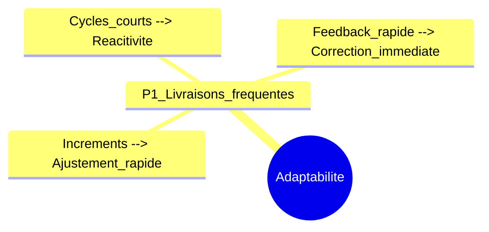
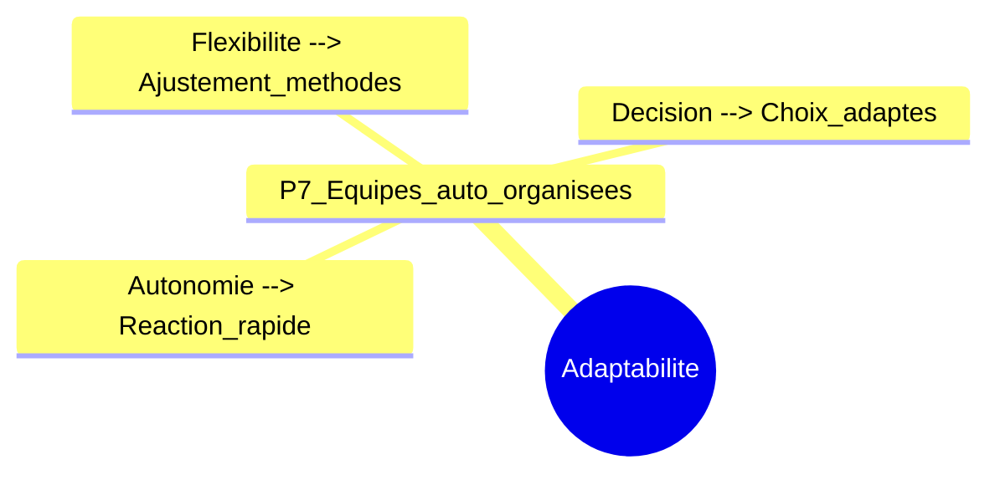
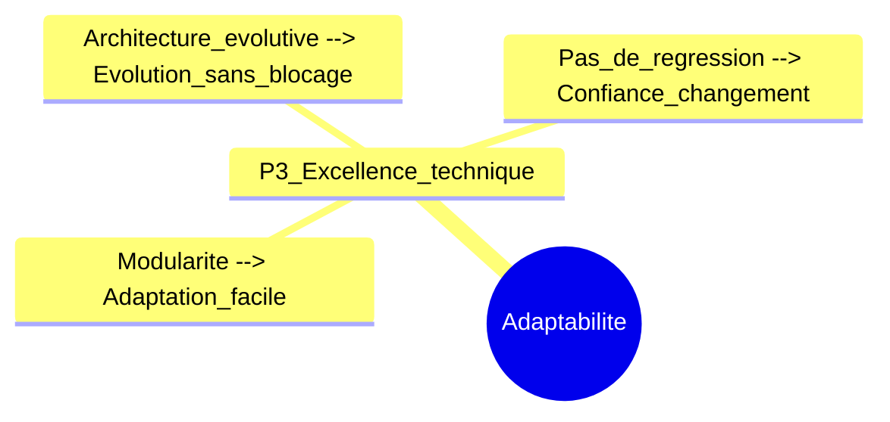
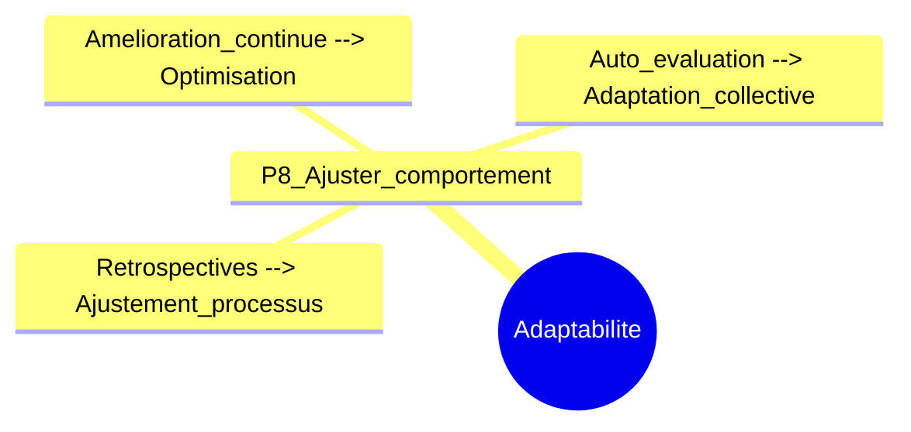

---
tags:
  - agile
---
Parfait Adam. Je vais tout réécrire proprement : chaque principe aura :

- Phrase courte intégrant les **mots-clés**
    
- Chunk **Mermaid** liant **Adaptabilité → mots-clés → bref effet**
    

---

### **P1 – Livraisons fréquentes**

**Phrase courte :**  
Les **incréments**, les **cycles courts** et le **feedback rapide** permettent à l’équipe de s’adapter rapidement aux changements.

---

### **P7 – Équipes auto-organisées**

**Phrase courte :**  
L’**autonomie**, la **flexibilité** et la **décision** permettent à l’équipe d’ajuster architecture et méthodes selon les contraintes.

---

### **P3 – Excellence technique / Conception**

**Phrase courte :**  
La **modularité**, une **architecture évolutive** et l’absence de **régression** permettent d’intégrer les changements sans bloquer le projet.

---

### **P8 – Ajuster comportement**

**Phrase courte :**  
Les **rétrospectives**, l’**amélioration continue et collective** et l’**auto-évaluation** permettent à l’équipe de s’ajuster constamment.

---

### **P10 – Travail ensemble quotidien**

**Phrase courte :**  
La **communication continue**, les **décisions rapides** et la **transparence** permettent d’identifier et d’intégrer rapidement les changements.

---

### **P12 – Accueillir le changement**

**Phrase courte :**  
La **réactivité**, la **gestion de l’incertitude** et la **priorisation** permettent d’adapter le produit même tard dans le projet.

---

Si tu veux, je peux maintenant **fusionner tous ces chunks en une seule mind map complète**, **profondeur ≤4**, **nodes bien espacés**, **liens gris**, prête pour un rendu visuel clair et un exo 20/20.

Veux‑tu que je fasse ça ?