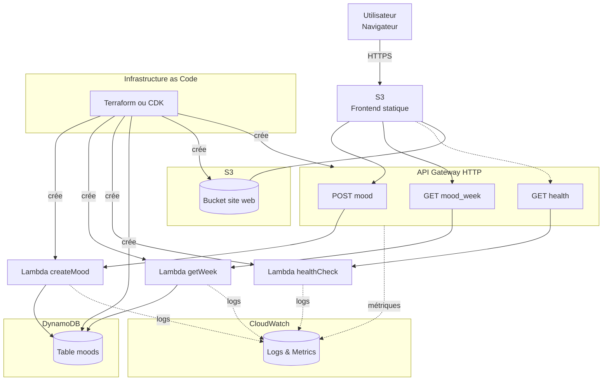
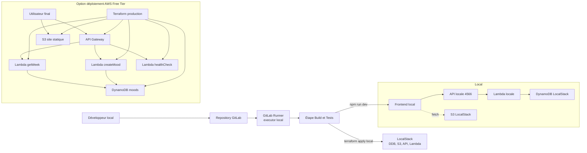
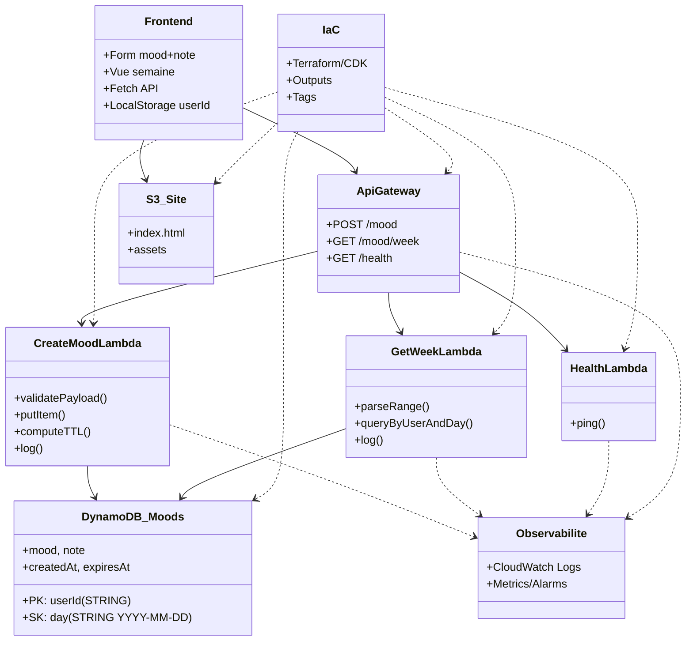

---
tags:
  - cloud
  - exos
---
Voici **3 diagrammes Mermaid** d’architecture détaillée (valides).

# Archi fonctionnelle (flux)

# Archi déploiement (local vs AWS)

# Archi logique (composants et dépendances)

