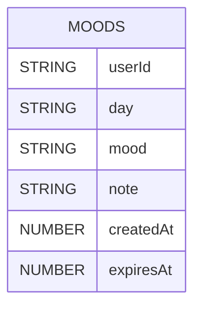
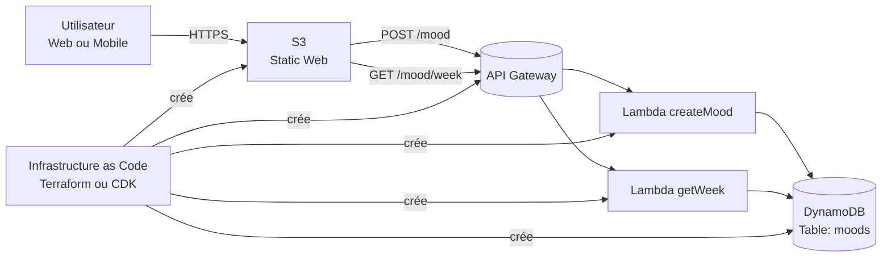
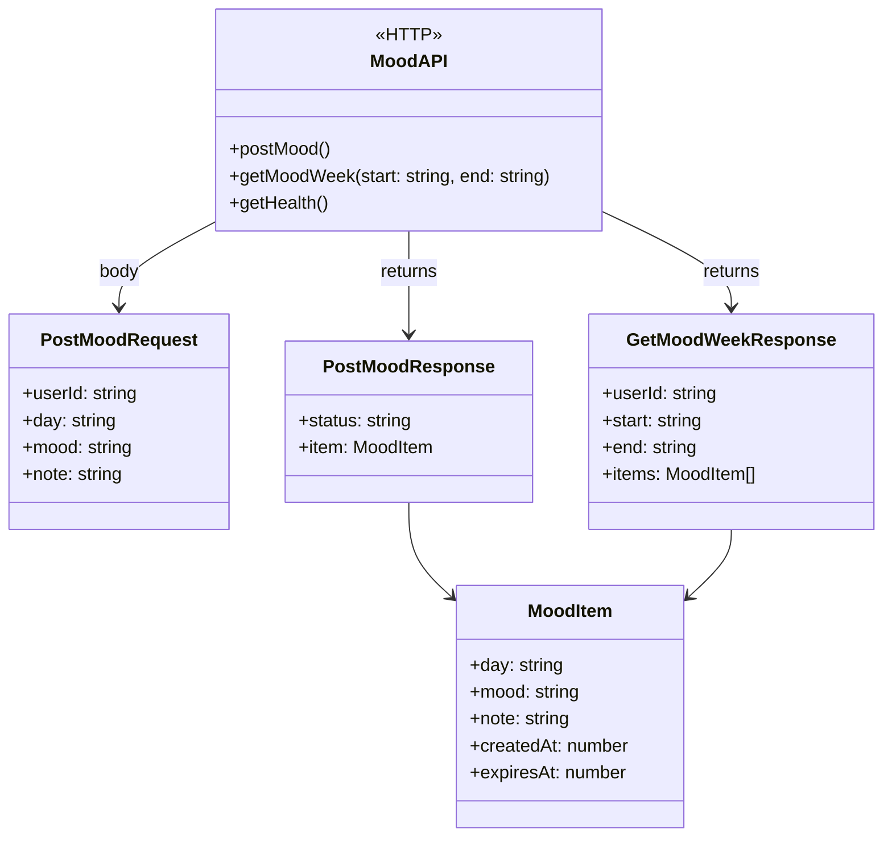
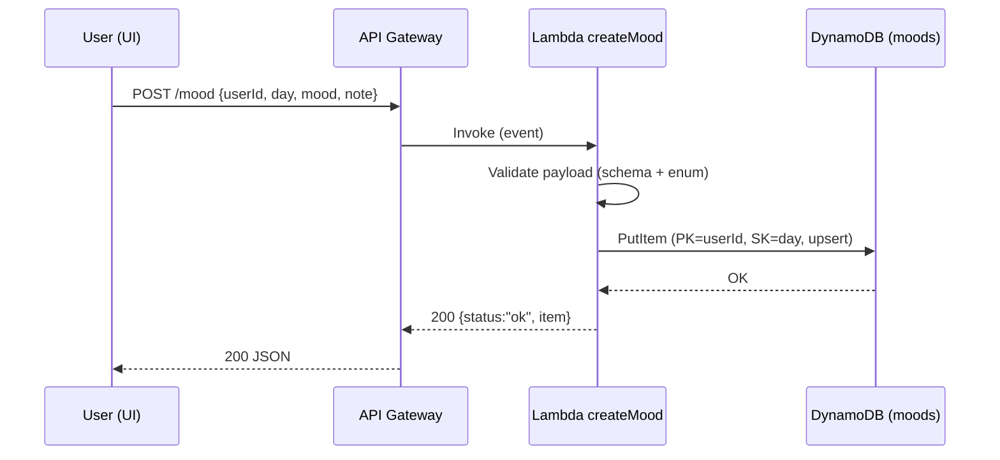
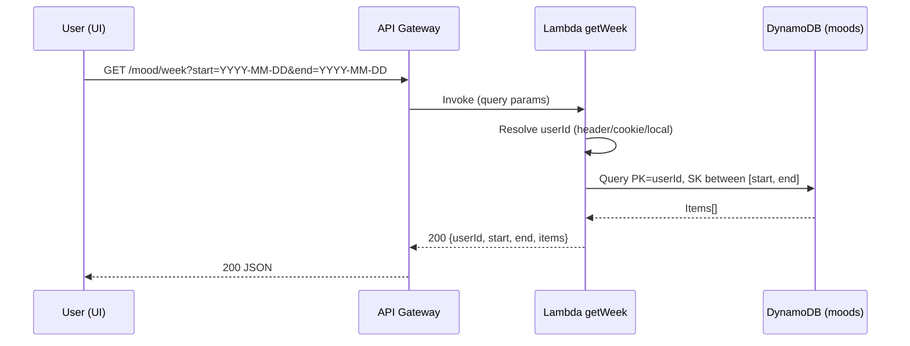
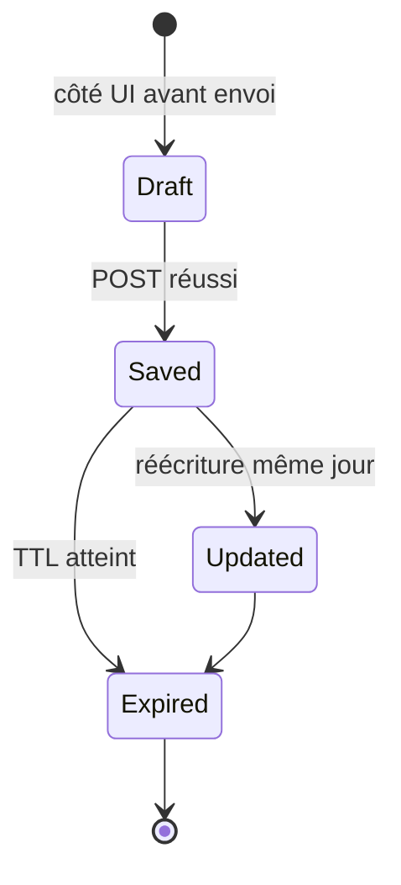
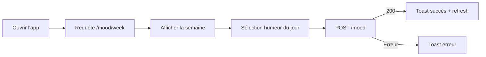

---
tags:
  - cloud
  - exos
---
# Projet : Mood Tracker Minimaliste — AWS Serverless

## Objectif du projet

Développer une application web minimaliste et élégante permettant à chaque utilisateur d’enregistrer son humeur quotidienne, d’y ajouter une courte note optionnelle et de visualiser son évolution sur la semaine.

Le tout est réalisé **entièrement en architecture serverless AWS**, pour garantir simplicité, scalabilité automatique et coût quasi nul.

---

## Stack technique

|Composant|Usage|Justification|
|---|---|---|
|**AWS Lambda**|Traitement métier (création et récupération d’humeurs)|Aucune gestion serveur, facturation à l’usage|
|**API Gateway**|Exposition des endpoints REST (`/mood`, `/mood/week`)|Interface REST sécurisée et scalable|
|**DynamoDB**|Stockage NoSQL des humeurs quotidiennes|Accès rapide, TTL intégré, facile à requêter par date|
|**S3**|Hébergement du frontend statique (HTML/CSS/JS)|Simple, économique, compatible CloudFront|
|**Terraform ou AWS CDK**|Infrastructure as Code (IaC)|Reproductibilité, déploiement automatisé|
|**(Optionnel)** Cognito|Authentification des utilisateurs|Facile à ajouter pour un MVP sécurisé|

---

##  Concepts principaux

- **Entrée d’humeur quotidienne unique par utilisateur**
    
- **Stockage horodaté** (clé composite : `userId`, `day`)
    
- **Visualisation hebdomadaire**
    
- **Nettoyage automatique** via **TTL** DynamoDB (par ex. 6 mois)
    
- **Interface épurée**, responsive, avec représentation graphique simple (Chart.js ou SVG)
    

---

## ⚙️ Fonctionnalités principales

|Fonction|Description|Endpoint|
|---|---|---|
|Créer / mettre à jour humeur du jour|Sauvegarde du mood + note|`POST /mood`|
|Consulter les humeurs de la semaine|Récupération par période|`GET /mood/week?start=YYYY-MM-DD&end=YYYY-MM-DD`|
|Vérifier la disponibilité API|Healthcheck|`GET /health`|
|Nettoyage automatique|Suppression auto (TTL) après X mois|via DDB TTL|

---

## 📦 Modèle de données DynamoDB

---

## 🧠 Architecture applicative

---

## 📜 Contrats d’API

---

## 🔁 Séquences de fonctionnement

### Création ou mise à jour d’une humeur (POST /mood)

---

### Lecture des humeurs hebdomadaires (GET /mood/week)

---

## 🪴 États d’une humeur

---

## 🎨 Parcours utilisateur

---

## 🧰 Prérequis techniques

- **AWS Account** (Free Tier suffit)
    
- **AWS CLI configuré**
    
- **Terraform ≥ 1.5** ou **AWS CDK (Python/TypeScript)**
    
- **Node.js ≥ 18** (pour les Lambdas)
    
- **npm / yarn** pour le front minimal
    
- **Optionnel :** Chart.js pour visualisation dans le navigateur
    

---

## 📈 Bonnes pratiques intégrées

- Validation des payloads (via `ajv` ou `pydantic`)
    
- Logs structurés JSON (`console.log` JSON ou `structlog`)
    
- Gestion du TTL DynamoDB
    
- Variables d’environnement (nom table, TTL, région)
    
- CORS activé (origines spécifiques)
    
- Observabilité via **CloudWatch Logs + Metrics**
    
- Alarme CloudWatch : erreurs Lambda > 1% sur 5 min
    

---

## 💡 Améliorations possibles (évolutions futures)

- Authentification via Cognito (userId = sub)
    
- Graphique d’évolution mood sur mois complet
    
- Export CSV ou PDF
    
- Fonction d’analyse : mood moyen, tendance
    
- PWA pour usage mobile hors ligne
    
