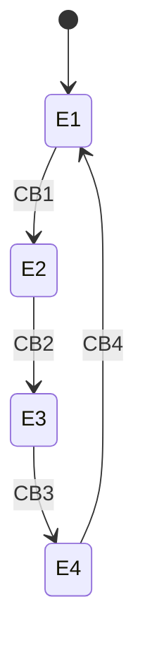
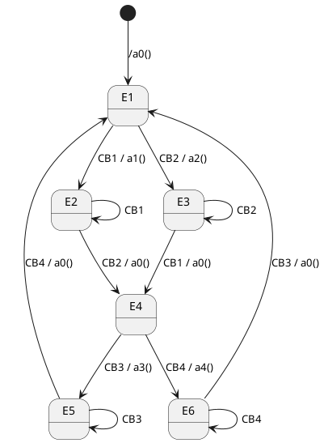
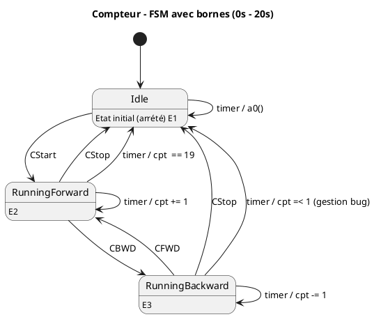
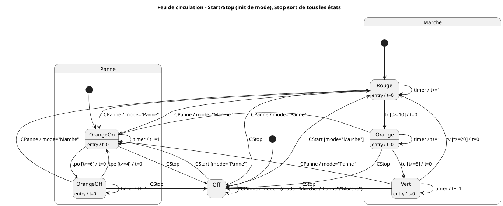

---
tags:
  - exos
  - front
  - exam
---
## Introduction
**Contrôle écrit (3h)** portant sur la [[Programmation Objet]] avancée et la [[Programmation Front]].  
L’épreuve évalue la **modélisation back et front** (sans intégration de données).

**Contenu pédagogique couvert :**
- **Front :**
    - Automate d’état / diagramme d’état-transition (state machine diagram)
    - Diagrammes de composants (notation spécifique du professeur)
    - Table de transition d’état (state transition table)
    - Passage à pseudo-code depuis la table
- **Back :**
    - Design patterns (modélisation)
    - Design pattern MVC
    - Diagramme de classes UML
## Programmation Front 
### Automates d'état
##### Exo 1
On dispose de 4 boutons numérotés de 1 à 4.
- Cliquer sur le bouton **n** active le bouton **n+1** et désactive le bouton **n**.
- Cliquer sur le bouton **4** active le bouton **1**.
![[Pasted image 20250916152128.png]]
###### **Automate d'état** : 

##### Exo 2 
On dispose de 4 boutons numérotés de 1 à 4.
- Cliquer sur les boutons 1 et 2 active les boutons 3 et 4 et désactivent les boutons 1 et 2.
- Et vice vers ça
![[Pasted image 20250916153028.png]]
###### **Automate d'état**

#### Exo 3 - à faire
##### Exo 4
On dispose d'une fenêtre permettant de faire un compte à rebours avant et arrière, Bornés entre 0 et 20 , un bouton start et stop, et un afficheur de numero
![[Pasted image 20250916153553.png]]
###### **Automate d'état**

##### Exo 5
Dans cet exercice plus complexe, on gère deux modes de fonctionnement du feu : **Marche** et **Panne**, avec possibilité de basculer entre eux.
**Événements disponibles :**
- `CStart` : démarrage (active l’état initial du mode courant).
- `CStop` : arrêt (retour à l’état _Off_ depuis n’importe quel état).
- `CPanne` : bascule entre _Marche_ et _Panne_.
- `tr`, `to`, `tv` : timers associés aux phases Rouge, Orange et Vert.
- `tpo`, `tpe` : timers associés aux états Panne (Orange allumé/éteint).

**Règles :**
- En mode **Marche**, le cycle suit _Rouge → Orange → Vert → Rouge_, avec déclenchement basé sur `tr`, `to`, `tv`.
- En mode **Panne**, le feu alterne _OrangeOn ↔ OrangeOff_ avec `tpo` et `tpe`.
- `CStop` ramène toujours à l’état _Off_.
- `CPanne` provoque un basculement immédiat vers l’état initial du mode opposé.
Un **automate d’état** doit être construit pour représenter ces comportements.
###### Automate d'état 

