---
tags:
  - exam
  - POO
  - eng
---
## Etat de l'art 
### Petit rappel UML de classes

- `..|>` **Réalisation (implémente une interface)**  
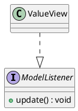
    Sens : la classe de gauche **implémente** l’interface à droite (triangle côté interface).  
    Exemple : `ValueView ..|> ModelListener` (la vue implémente `ModelListener`).
    
- `o--` **Agrégation (has-a faible)**  
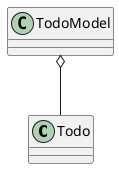
    Sens : **losange creux** côté agrégat : l’objet agrégateur **contient/référence** des éléments qui **peuvent vivre sans lui**.  
    Exemple : `TodoModel o-- Todo` (le modèle contient des todos, mais un `Todo` peut exister seul).
    
- `-->` **Association dirigée (référence / utilise)**  
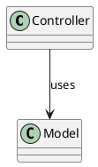
    Sens : la classe de gauche **détient une référence** ou **utilise** celle de droite (navigation vers la droite).  
    Exemple : `Controller --> Model` (le contrôleur appelle le modèle).
### Liste des design patterns les plus utilisés

#### 1) Singleton

**Pourquoi ?** Garantir **une seule instance** (ex: config, logger).  
**Comment ?** Constructeur privé + méthode statique `getInstance()`.

**Exemple (Config appli)** : un `ConfigManager` lu une fois, utilisé partout.

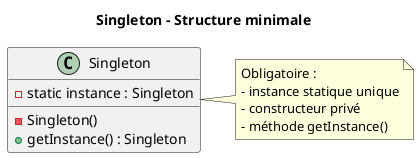


####  Abstract Factory

**Pourquoi ?** Créer des **familles** d’objets liés sans lier le code aux classes concrètes.  
**Comment ?** Une factory abstraite avec méthodes de création par type.

**Exemple (UI thème clair/sombre)** : `createButton()` et `createCheckbox()` renvoient versions Light/Dark.

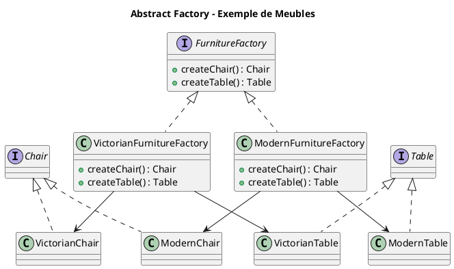


#### 6) Décorateur

**Pourquoi ?** **Ajouter** des fonctionnalités **à la volée** sans héritage lourd.  
**Comment ?** Un décorateur enveloppe le composant et délègue.

**Exemple (Boisson + extras)** : `cost()` augmente avec `MilkDecorator`, `WhipDecorator`.

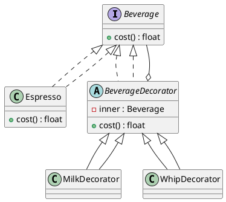

#### Builder 

Dans le **Builder pattern** :

1. **Builder (interface/abstrait)**
    
    - C’est le **contrat** qui définit les étapes de construction.
        
    - Exemple : `buildWalls()`, `buildRoof()`, `buildWindows()`, `getResult()`.
        
2. **ConcreteBuilder(s)**
    
    - Ce sont les **constructeurs réels** qui suivent la recette.
        
    - Chaque ConcreteBuilder peut construire un produit final **différent** avec les mêmes étapes.
        
    - Exemple :
        
        - `WoodenHouseBuilder` → construit une maison en bois.
            
        - `StoneHouseBuilder` → construit une maison en pierre.
            
3. **Director (optionnel)**
    
    - Orchestrer les étapes toujours dans le même ordre.
        
    - Exemple : `constructSimpleHouse()` appelle `buildWalls → buildRoof → buildDoor`.
        
4. **Product**
    
    - C’est l’objet final (la maison, le burger, la voiture, etc.).

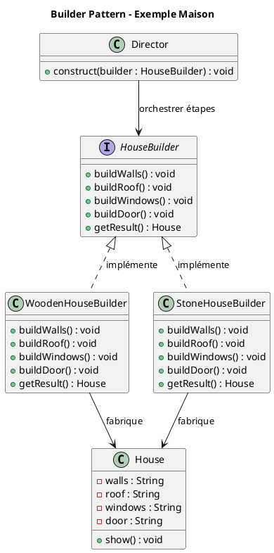
#### Command
 🎯 Résumé

- **Command** = interface avec `execute()`.
    
- **ConcreteCommand** = encapsule une action (ex : allumer/éteindre la lumière).
    
- **Receiver** = l’objet qui fait vraiment le travail (`Light`).
    
- **Invoker** = celui qui lance la commande (`RemoteControl`).
    
- **Client** = configure l’Invoker avec la commande voulue.
![[Pasted image 20250923095254.png]]
#### 8) Observer

**Pourquoi ?** **Notifier automatiquement** plusieurs abonnés quand l’état change.  
**Comment ?** `Subject` gère `register/remove/notify`, `Observer.update()`.

**Exemple (Cours bourse)** : observateurs reçoivent les nouvelles valeurs.

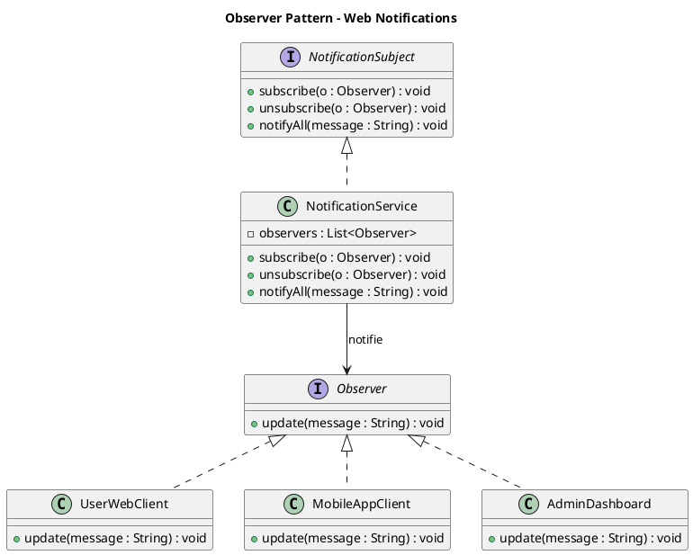


---

#### 9) State

**Pourquoi ?** Faire **varier le comportement** selon l’**état interne** sans `if` partout.  
**Comment ?** `Context` délègue aux objets-états.

**Exemple (Lecteur audio)** : `Stopped`, `Playing`, `Paused`.

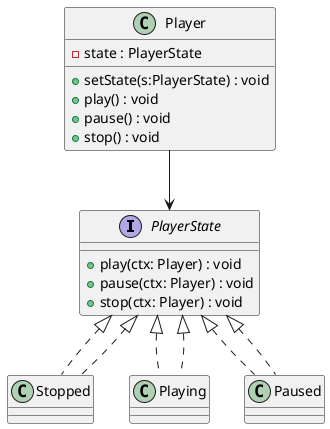

OK Adam — version **simple & pédagogique**, **PlantUML only**, **3 exemples**.

## MVC

- **Idée** : séparer **M**étier (Model), **V**isuel (View), **C**ontrôle (Controller).
    
- **Pourquoi** : code clair, testable, plusieurs vues sur le même modèle.
    
- **Flux** :
    
    1. L’utilisateur agit sur la **View**.
        
    2. La View appelle le **Controller**.
        
    3. Le Controller modifie le **Model**.
        
    4. Le Model notifie les **Views** (Observer).
        
    5. Les Views relisent le Model et se **mettent à jour**.
        
- **Règles d’or** : métier dans **Model**, UI dans **View**, orchestration dans **Controller**.
    

---

### Exemple 1 — Compteur (boutons + slider)

Compteur : l’utilisateur clique/glisse, la View envoie l’intention au Controller. Le Controller met à jour `value` via `model.setValue(v)`. Le Model notifie et les vues relisent puis se mettent à jour
### Classes (PlantUML)

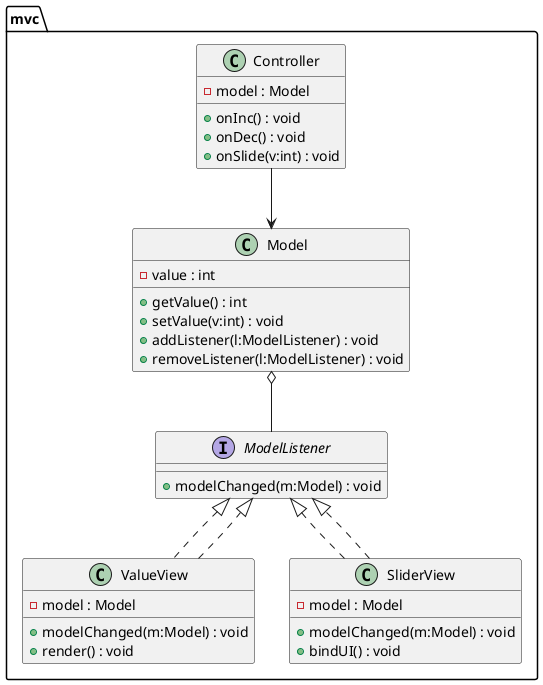

### Séquence (PlantUML)


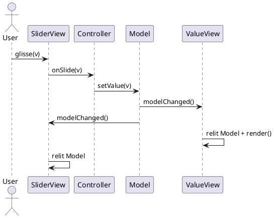

---

### Exemple 2 — Todo List (ajouter / cocher)

Todo List : l’utilisateur saisit ou coche/decoche, les vues appellent le Controller. Le Controller ajoute ou bascule l’item dans le `TodoModel`. Le modèle notifie et la liste se re-rend avec l’état à jour.
### Classes (PlantUML)

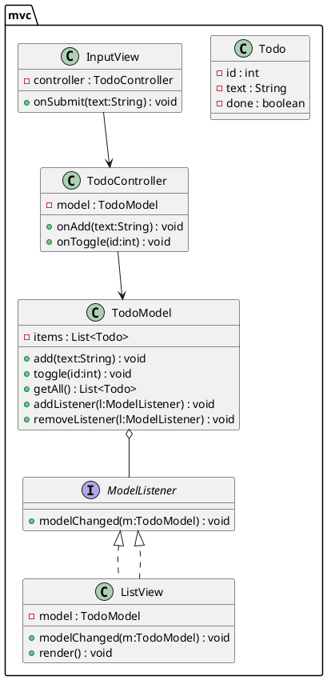

### Séquence (PlantUML)

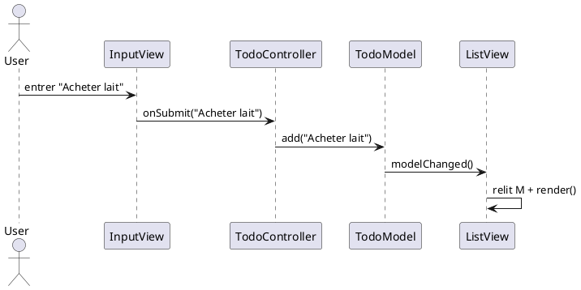

---

### Exemple 3 — Lecteur Audio (play/pause/stop)

Lecteur audio : clic Play/Pause/Stop sur ButtonsView, le Controller reçoit l’action. Le Controller appelle `play/pause/stop` sur `PlayerModel` (état interne). Le modèle notifie et StatusView met à jour le statut.
### Classes (PlantUML)

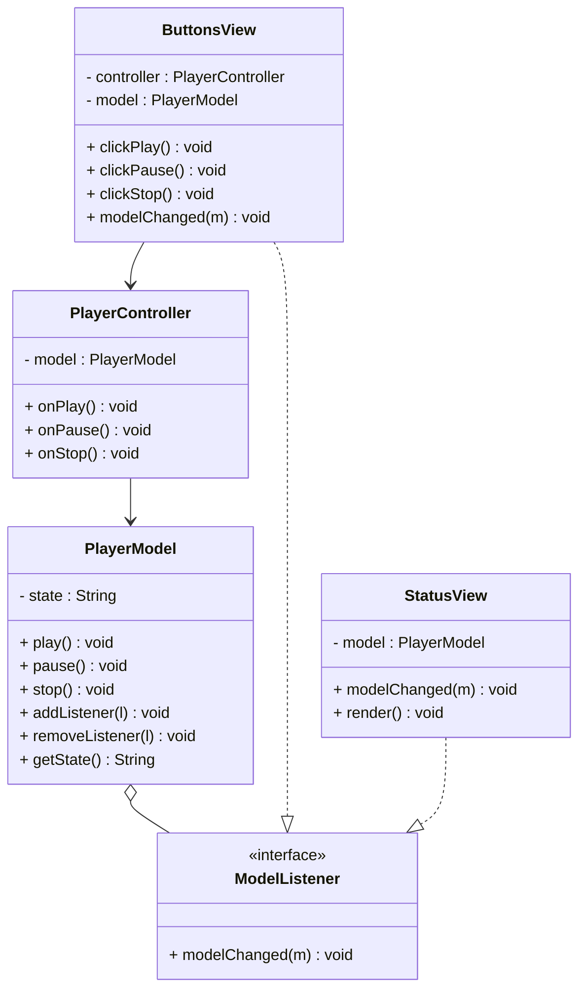

### Séquence (PlantUML)

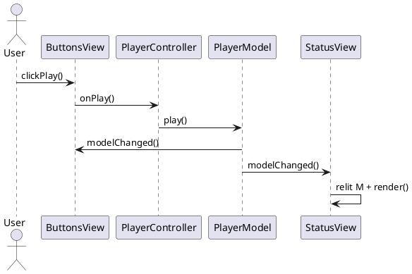
## Historique des exos

### Exercice — Modéliser une appli MVC + Observer (Java/Swing)

#### Objectif

Concevoir l’architecture **MVC** d’une mini-appli : un modèle entier `value`, des vues qui l’affichent, des contrôleurs (boutons/slider) qui le modifient. Produire les **diagrammes PlantUML** à chaque étape d’affinage.

#### Livrables

1. Série de **diagrammes UML (PUML)** montrant l’évolution de la modélisation (étapes 1→6).
    
2. Un **diagramme final** intégré.
    
3. Une **liste de bonnes pratiques d’extension** (sans code).
    

#### Contraintes

- Séparation stricte **Model / View / Controller**.
    
- Propagation des changements via **Observer** (pas d’accès direct Vue→Vue).
    
- Pas de cycles de dépendances entre packages.
    

---

#### Étape 1 — Cadrage par packages (couplage global)

But : poser les **dépendances haut niveau**.

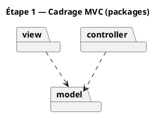

---

#### Étape 2 — Modèle et Observer

But : définir l’**état** et le mécanisme de **notification**.

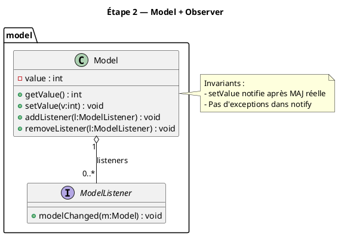

---

#### Étape 3 — Vues textuelles

But : deux vues **passives** qui observent le modèle.

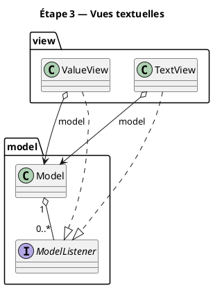

---
#### Étape 4 — Contrôleurs (boutons)

But : des **contrôleurs** qui traduisent les actions UI en **MAJ du modèle**.

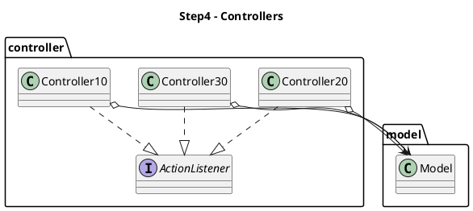

---

#### Étape 5 — Composition de fenêtre

But : une **fenêtre** qui compose vues et branche les contrôleurs.

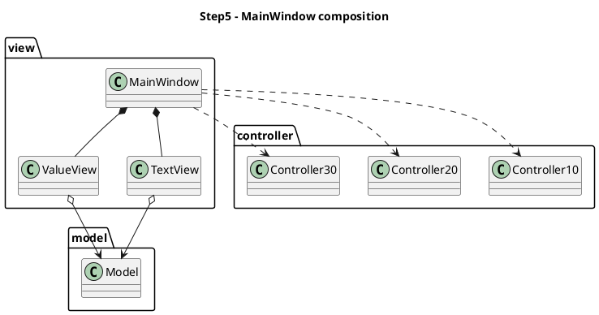

---

#### Étape 6 — Extension : Slider + Règle d’activation des boutons

But : ajouter un **slider** couplé au modèle et une **vue de boutons** désactivant le bouton = valeur courante.

```plantuml
@startuml
title Step6 - Slider and ButtonsView
package model {
  class Model
  interface ModelListener
  Model "1" o-- "0..*" ModelListener
}

package view {
  class SliderView
  class ButtonsView
  SliderView  ..|> ModelListener
  ButtonsView ..|> ModelListener
  SliderView  o--> Model
  ButtonsView o--> Model
}

package controller {
  interface ChangeListener
  class SliderController
  SliderController ..|> ChangeListener
  SliderController o--> Model
  SliderController ..> SliderView
}

note bottom of ButtonsView
Contract:
- disable 10/20/30 when value equals it
- reevaluate on each notification
end note
@enduml
```

---

#### Diagramme final — Vue d’ensemble

```plantuml
@startuml
title Final - MVC + Observer overview
package model {
  class Model {
    - value : int
    + getValue() : int
    + setValue(v:int) : void
    + addListener(l:ModelListener) : void
    + removeListener(l:ModelListener) : void
  }
  interface ModelListener {
    + modelChanged(m:Model) : void
  }
  Model "1" o-- "0..*" ModelListener
}

package view {
  class MainWindow
  class ValueView
  class TextView
  class SliderView
  class ButtonsView

  ValueView   ..|> ModelListener
  TextView    ..|> ModelListener
  SliderView  ..|> ModelListener
  ButtonsView ..|> ModelListener

  MainWindow *-- ValueView
  MainWindow *-- TextView
  MainWindow *-- SliderView
  MainWindow *-- ButtonsView

  ValueView   o--> Model
  TextView    o--> Model
  SliderView  o--> Model
  ButtonsView o--> Model
}

package controller {
  interface ActionListener
  interface ChangeListener
  class Controller10
  class Controller20
  class Controller30
  class SliderController

  Controller10 ..|> ActionListener
  Controller20 ..|> ActionListener
  Controller30 ..|> ActionListener
  SliderController ..|> ChangeListener

  Controller10     o--> Model
  Controller20     o--> Model
  Controller30     o--> Model
  SliderController o--> Model
  SliderController ..> SliderView
}
@enduml

```

---

#### Bonnes pratiques d’extension 

- **SOC forte** : Model sans dépendances UI ; Vues sans logique métier ; Contrôleurs minces.
    
- **Observer propre** : notifie **après** MAJ réelle ; listeners tolérants (pas d’exception).
    
- **Idempotence UI** : chaque vue vérifie l’état avant d’écrire (éviter boucles).
    
- **Variabilité** : introduire des **interfaces** pour points d’extension (ex. `Formatter`, `Validator`).
    
- **Packages stables** : `view/controller` dépendent de `model`, jamais l’inverse.
    
- **Règles UI** (ex. disable boutons) encapsulées **dans une vue dédiée** (pas dans le modèle).
    
- **Évolutivité** : ajouter un nouveau contrôleur (ex. bouton “50”) **sans modifier** le modèle ni les autres vues.
    
- **Testabilité** : logique de décision dans des classes **sans UI** (ex. stratégie d’activation).
    
- **Concurrence UI** : MAJ de vues comme **réactions** aux notifications.
    
- **Traçabilité** : snapshot PUML à chaque extension.

## Exos modèles 
### Objectif  
Modéliser en MVC une mini-appli qui gère un niveau de luminosité (0–100).

Exigences fonctionnelles

- Un **Slider** ajuste le niveau.
    
- Trois **boutons 0/50/100** fixent la valeur.
    
- Le bouton correspondant à la valeur courante est **désactivé**.
    
- Deux vues textuelles :
    
    - `LevelView` (affiche le nombre),
        
    - `TextView` (affiche "Level = X").
        

Contraintes d’architecture

- **Observer** : `ModelListener.modelChanged(Model)`.
    
- **Model** sans dépendance UI, notifie après changement.
    
- **Views** observent le modèle, pas de logique métier.
    
- **Controllers** traduisent l’UI en `model.setLevel(...)`.
    
- **MainWindow** compose les vues et branche les contrôleurs.
    
- Packages : `model`, `view`, `controller`.
    

Livrable attendu

- Un **diagramme de classes PlantUML** montrant classes, interfaces, packages, associations, implémentations, compositions, multiplicités et la règle d’activation des boutons (note).
    

---

### Correction (PUML)

```plantuml
@startuml
title MVC - Brightness Controller (class diagram)

package model {
  class Model {
    - level : int
    + getLevel() : int
    + setLevel(v:int) : void
    + addListener(l:ModelListener) : void
    + removeListener(l:ModelListener) : void
  }
  interface ModelListener {
    + modelChanged(m:Model) : void
  }
  Model "1" o-- "0..*" ModelListener
}

package view {
  class MainWindow
  class LevelView
  class TextView
  class SliderView
  class ButtonsView

  LevelView   ..|> model.ModelListener
  TextView    ..|> model.ModelListener
  SliderView  ..|> model.ModelListener
  ButtonsView ..|> model.ModelListener

  MainWindow *-- LevelView
  MainWindow *-- TextView
  MainWindow *-- SliderView
  MainWindow *-- ButtonsView

  LevelView   o--> model.Model : model
  TextView    o--> model.Model : model
  SliderView  o--> model.Model : model
  ButtonsView o--> model.Model : model
}

package controller {
  interface ActionListener
  interface ChangeListener

  class Controller0
  class Controller50
  class Controller100
  class SliderController

  Controller0   ..|> ActionListener
  Controller50  ..|> ActionListener
  Controller100 ..|> ActionListener
  SliderController ..|> ChangeListener

  Controller0     o--> model.Model : model
  Controller50    o--> model.Model : model
  Controller100   o--> model.Model : model
  SliderController o--> model.Model : model
  SliderController ..> view.SliderView
}

note bottom of view.ButtonsView
ButtonsView rule:
- disable button 0 if level==0
- disable button 50 if level==50
- disable button 100 if level==100
- reevaluate on each modelChanged
end note
@enduml
```