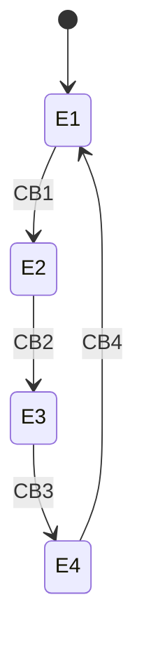
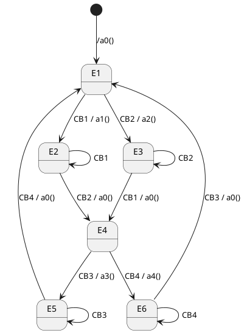
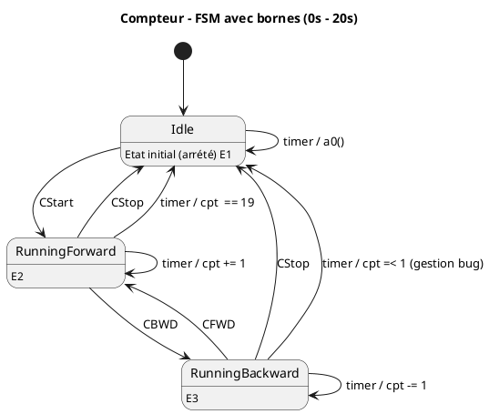
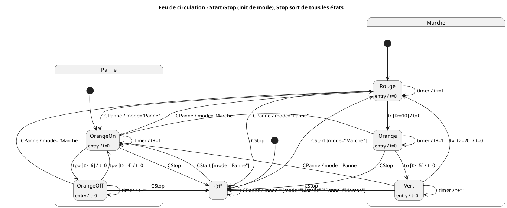
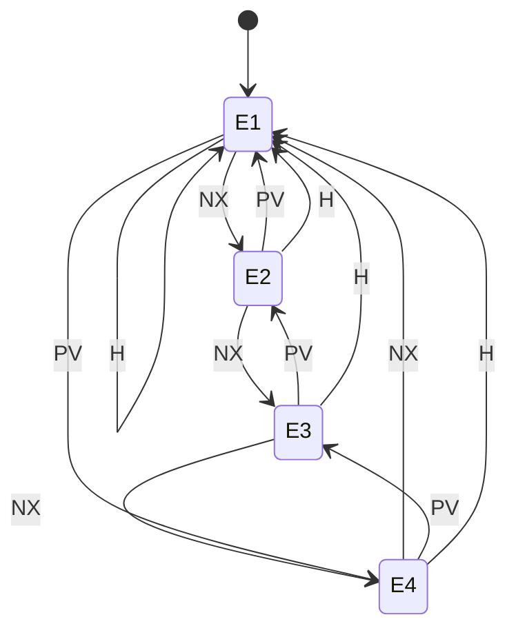
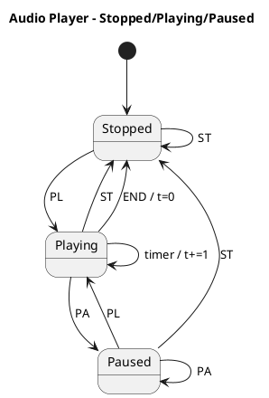
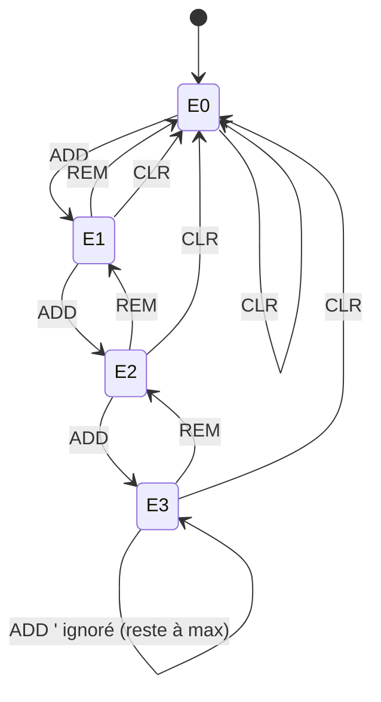
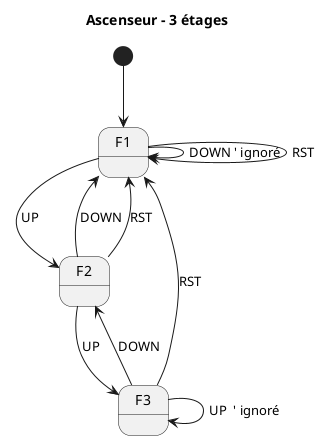
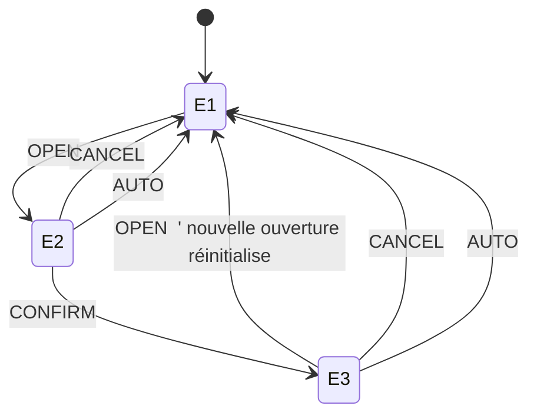

---
tags:
  - exos
  - front
  - exam
---

## Programmation Front 
### Automates d'état et Tables de transition
#### Historique 
##### Exo 1
On dispose de 4 boutons numérotés de 1 à 4.
- Cliquer sur le bouton **n** active le bouton **n+1** et désactive le bouton **n**.
- Cliquer sur le bouton **4** active le bouton **1**.
![[Pasted image 20250916152128.png]]
###### **Automate d'état** : 

###### Table de transition (Matrice État / Événement)

| État | CB1  | CB2  | CB3  | CB4  |
| ---- | ---- | ---- | ---- | ---- |
| E1   | ⇒ E2 | X    | X    | X    |
| E2   | X    | ⇒ E3 | X    | X    |
| E3   | X    | X    | ⇒ E4 | X    |
| E4   | X    | X    | X    | ⇒ E1 |
##### Exo 2 
On dispose de 4 boutons numérotés de 1 à 4.
- Cliquer sur les boutons 1 et 2 active les boutons 3 et 4 et désactivent les boutons 1 et 2.
- Et vice vers ça
![[Pasted image 20250916153028.png]]
###### **Automate d'état**

###### Table de transition (Matrice État / Événement)

| État | CB1       | CB2       | CB3       | CB4       |
|------|-----------|-----------|-----------|-----------|
| E1   | ⇒ E2 a1   | ⇒ E3 a2   | X         | X         |
| E2   | ⇒ E2      | ⇒ E4 a0   | X         | X         |
| E3   | ⇒ E4 a0   | ⇒ E3      | X         | X         |
| E4   | X         | X         | ⇒ E5 a3   | ⇒ E6 a4   |
| E5   | X         | X         | ⇒ E5      | ⇒ E1 a0   |
| E6   | X         | X         | ⇒ E1 a0   | ⇒ E6      |

##### Exo 3 - à faire
##### Exo 4
On dispose d'une fenêtre permettant de faire un compte à rebours avant et arrière, Bornés entre 0 et 20 , un bouton start et stop, et un afficheur de numero

![[Pasted image 20250916153553.png]]
###### **Automate d'état**

###### Table de transition (Matrice État / Événement)

| État            | CStart     | CStop      | timer            | CFWD       | CBWD       |
|-----------------|------------|------------|------------------|------------|------------|
| E1 (Idle)       | ⇒ E2       | X          | a0()             | X          | X          |
| E2 (Forward)    | X          | ⇒ E1       | ⇒ E2 / cpt += 1  | X          | ⇒ E3       |
| E3 (Backward)   | X          | ⇒ E1       | ⇒ E3 / cpt -= 1  | ⇒ E2       | X          |

##### Exo 5

Dans cet exercice plus complexe, on gère deux modes de fonctionnement du feu : **Marche** et **Panne**, avec possibilité de basculer entre eux.
![[36b104e6-17c9-4575-83a4-89b2a1f46c80.png]]
**Événements disponibles :**
- `CStart` : démarrage (active l’état initial du mode courant).
- `CStop` : arrêt (retour à l’état _Off_ depuis n’importe quel état).
- `CPanne` : bascule entre _Marche_ et _Panne_.
- `tr`, `to`, `tv` : timers associés aux phases Rouge, Orange et Vert.
- `tpo`, `tpe` : timers associés aux états Panne (Orange allumé/éteint).

**Règles :**

- En mode **Marche**, le cycle suit _Rouge → Orange → Vert → Rouge_, avec déclenchement basé sur `tr`, `to`, `tv`.
    
- En mode **Panne**, le feu alterne _OrangeOn ↔ OrangeOff_ avec `tpo` et `tpe`.
    
- `CStop` ramène toujours à l’état _Off_.
    
- `CPanne` provoque un basculement immédiat vers l’état initial du mode opposé.
    

Un **automate d’état** doit être construit pour représenter ces comportements.
###### Automate d'état 

###### Table de transition (Matrice État / Événement) — Exo 5

| État                | CStart                                          | CStop  | CPanne                               | timer                 | tr                         | to                         | tv                         | tpo                        | tpe                        |
|---------------------|--------------------------------------------------|--------|--------------------------------------|-----------------------|----------------------------|----------------------------|----------------------------|----------------------------|----------------------------|
| Off                 | ⇒ Marche.Rouge *(si mode=Marche)* ⇒ Panne.OrangeOn *(si mode=Panne)* | X      | ⇒ Off / mode ↔                       | X                     | X                          | X                          | X                          | X                          | X                          |
| Marche.Rouge        | X                                                | ⇒ Off  | ⇒ Panne.OrangeOn / mode="Panne"      | ⇒ Rouge / t+=1        | ⇒ Orange \[t≥10] / t=0     | X                          | X                          | X                          | X                          |
| Marche.Orange       | X                                                | ⇒ Off  | ⇒ Panne.OrangeOn / mode="Panne"      | ⇒ Orange / t+=1       | X                          | ⇒ Vert \[t≥5] / t=0        | X                          | X                          | X                          |
| Marche.Vert         | X                                                | ⇒ Off  | ⇒ Panne.OrangeOn / mode="Panne"      | ⇒ Vert / t+=1         | X                          | X                          | ⇒ Rouge \[t≥20] / t=0      | X                          | X                          |
| Panne.OrangeOn      | X                                                | ⇒ Off  | ⇒ Marche.Rouge / mode="Marche"       | ⇒ OrangeOn / t+=1     | X                          | X                          | X                          | ⇒ OrangeOff \[t≥6] / t=0   | X                          |
| Panne.OrangeOff     | X                                                | ⇒ Off  | ⇒ Marche.Rouge / mode="Marche"       | ⇒ OrangeOff / t+=1    | X                          | X                          | X                          | X                          | ⇒ OrangeOn \[t≥4] / t=0    |

#### Exos à faire

##### Exo 5

On souhaite modéliser le fonctionnement d’un sélecteur d’onglets numérotés de **1 à 4**.

- L’utilisateur peut cliquer sur un bouton **Next (NX)** pour passer à l’onglet suivant.
    
- Lorsqu’on est sur l’onglet **4**, un clic sur **NX** ramène automatiquement à l’onglet **1** (fonctionnement circulaire).
    
- De la même façon, un clic sur **Prev (PV)** ramène à l’onglet précédent. Si l’on est sur l’onglet **1** et que l’on clique sur **PV**, on revient à l’onglet **4**.
    
- Enfin, une touche **Home (H)** permet de revenir directement à l’onglet **1** depuis n’importe quel état.
    

L’automate doit représenter ce comportement cyclique et la priorité de la commande **Home**.

###### **Automate d'état** :

###### Table de transition (Matrice État / Événement)

|État|NX|PV|H|
|---|---|---|---|
|E1|⇒ E2|⇒ E4|⇒ E1|
|E2|⇒ E3|⇒ E1|⇒ E1|
|E3|⇒ E4|⇒ E2|⇒ E1|
|E4|⇒ E1|⇒ E3|⇒ E1|

---

##### Exo 6

On cherche à modéliser un petit **lecteur audio** avec trois états principaux : **Stopped**, **Playing**, et **Paused**.

- Depuis l’état **Stopped**, on peut démarrer la lecture avec l’événement **Play (PL)**.
    
- Une fois en **Playing**, l’utilisateur peut :
    
    - mettre en pause avec **Pause (PA)**,
        
    - arrêter complètement avec **Stop (ST)**,
        
    - ou bien laisser le **timer** avancer pour simuler la lecture du morceau.
        
- Si le morceau arrive à sa fin (**END**), on revient automatiquement à l’état **Stopped**.
    
- Depuis **Paused**, un clic sur **Play (PL)** reprend la lecture, un clic sur **Stop (ST)** arrête, et un nouveau clic sur **Pause (PA)** maintient la pause.
    

L’automate doit gérer ces transitions, y compris les clics redondants.
###### **Automate d'état**

###### Table de transition (Matrice État / Événement)

|État|PL|PA|ST|timer|END|
|---|---|---|---|---|---|
|E1 Stopped|⇒ E2|X|⇒ E1|X|X|
|E2 Playing|⇒ E3|⇒ E3|⇒ E1|⇒ E2 / t+=1|⇒ E1|
|E3 Paused|⇒ E2|⇒ E3|⇒ E1|X|X|

---

##### Exo 7

On dispose d’un **panier d’achats limité à 3 articles maximum**.

- Les actions possibles sont :
    
    - **ADD** : ajouter un article,
        
    - **REM** : retirer un article,
        
    - **CLR** : vider complètement le panier.
        
- Si le panier est vide (0) et que l’on retire un article (**REM**), l’action est ignorée (on reste à 0).
    
- Si le panier est plein (3 articles) et que l’on ajoute (**ADD**) encore un article, l’action est également ignorée (on reste à 3).
    
- La commande **CLR** ramène toujours le panier à l’état vide, quel que soit le nombre d’articles.
    

L’automate doit donc gérer un **compteur borné** avec une borne inférieure à 0 et une borne supérieure à 3.

###### **Automate d'état**

###### Table de transition (Matrice État / Événement)

|État|ADD|REM|CLR|
|---|---|---|---|
|E0 (0)|⇒ E1|⇒ E0|⇒ E0|
|E1 (1)|⇒ E2|⇒ E0|⇒ E0|
|E2 (2)|⇒ E3|⇒ E1|⇒ E0|
|E3 (3 max)|⇒ E3|⇒ E2|⇒ E0|

---

##### Exo 8

On modélise un **ascenseur simple** fonctionnant dans un immeuble de 3 étages : **F1, F2, F3**.

- Depuis chaque étage, on peut utiliser la commande **UP** (monter) ou **DOWN** (descendre).
    
- Si l’ascenseur est déjà au **dernier étage (F3)**, un ordre **UP** n’a aucun effet.
    
- Si l’ascenseur est déjà au **rez-de-chaussée (F1)**, un ordre **DOWN** n’a aucun effet.
    
- À tout moment, un ordre **RST (Reset)** ramène directement l’ascenseur à l’étage **F1**.
    

Cet automate illustre un déplacement **borné et dirigé** avec une commande de réinitialisation globale.

###### **Automate d'état**

###### Table de transition (Matrice État / Événement)

|État|UP|DOWN|RST|
|---|---|---|---|
|F1|⇒ F2|⇒ F1|⇒ F1|
|F2|⇒ F3|⇒ F1|⇒ F1|
|F3|⇒ F3|⇒ F2|⇒ F1|

---

##### Exo 9

##### Exo 9

On souhaite modéliser le comportement d’une **fenêtre modale** dans une application. La fenêtre peut être : **Closed**, **Open**, ou **Confirmed**.

- Depuis l’état **Closed**, un clic sur **OPEN** affiche la fenêtre.
    
- Lorsque la fenêtre est **Open**, l’utilisateur peut :
    
    - annuler avec **CANCEL** (elle se ferme),
        
    - valider avec **CONFIRM** (on passe à l’état **Confirmed**),
        
    - ou bien la fenêtre peut se fermer automatiquement via un **AUTO timeout**.
        
- Depuis l’état **Confirmed**, une nouvelle action (comme **OPEN**, **CANCEL** ou **AUTO**) ramène à l’état **Closed**, permettant une réinitialisation du dialogue.
    

L’automate permet donc de représenter un **cycle complet d’ouverture, interaction et fermeture** d’une fenêtre modale.

###### **Automate d'état**

###### Table de transition (Matrice État / Événement)

|État|OPEN|CANCEL|CONFIRM|AUTO|
|---|---|---|---|---|
|E1 Closed|⇒ E2|X|X|X|
|E2 Open|X|⇒ E1|⇒ E3|⇒ E1|
|E3 Confirmed|⇒ E1|⇒ E1|⇒ E3|⇒ E1|

---

tu veux d’autres exos (min/max, files d’attente, multi-modes) ou on corrige ceux-là d’abord ?

### Diagrammes de composants personalisés
#### Historique

##### Exo 1

On souhaite modéliser une **application de gestion et de tri des produits**.  
L’interface propose plusieurs éléments de filtrage :

- Un **champ de recherche textuel** permettant de saisir un motif pour filtrer les produits affichés.
    
- Une **case à cocher** permettant de choisir si l’on souhaite afficher uniquement les produits en stock.
    
- Un **slider (curseur)** permettant de définir un **prix maximal** afin de restreindre la liste affichée.
    
![[Pasted image 20250909144346.png]]
L’utilisateur peut donc combiner ces trois filtres pour explorer le catalogue. Chaque composant de l’IHM déclenche un événement (`OnChange`) qui est centralisé dans le composant parent `SearchBar`, lequel se charge d’émettre les signaux de mise à jour vers la partie affichage de l’application.

Ici la modélisation :  
![[Pasted image 20250909150832.png]]

---

##### Exo 2

On modélise une **application avec quatre boutons** représentant les **saisons** : _Spring, Summer, Fall, Winter_.

- Chaque bouton correspond à une transition vers une saison spécifique (`toSpring`, `toSummer`, `toFall`, `toWinter`).
    
- Lorsqu’un bouton est cliqué (`onClick`), un événement est envoyé au composant parent `Dialog`.
    
- Le `Dialog` centralise les états et gère l’affichage de la saison courante grâce à un label relié par un adaptateur.
    
- Certains boutons peuvent être désactivés selon le contexte (par exemple : `Enabled = false`).
    
![[Pasted image 20250917104847.png]]
L’objectif est de représenter l’interaction entre les composants d’IHM (boutons, label) et le cœur de l’application (`Dialog`), ainsi que le rôle de l’adaptateur qui transforme les données avant l’affichage.

Ici la modélisation :  
![[Pasted image 20250916115706.png]]