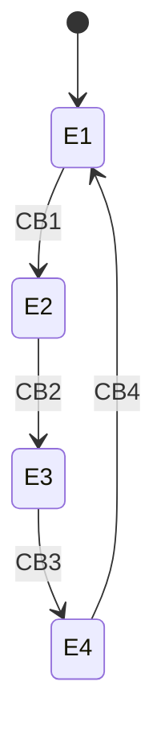
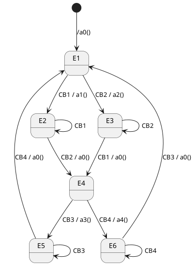
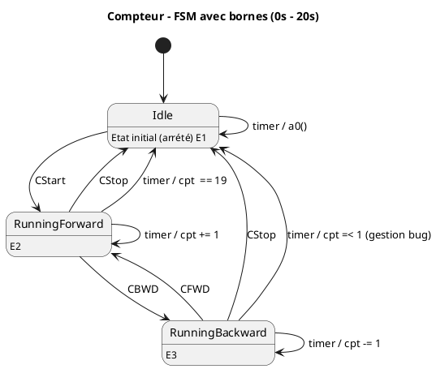
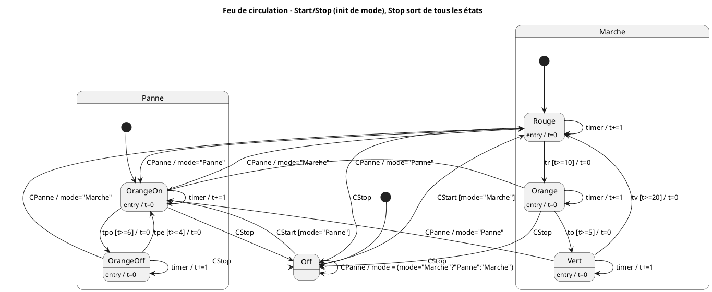
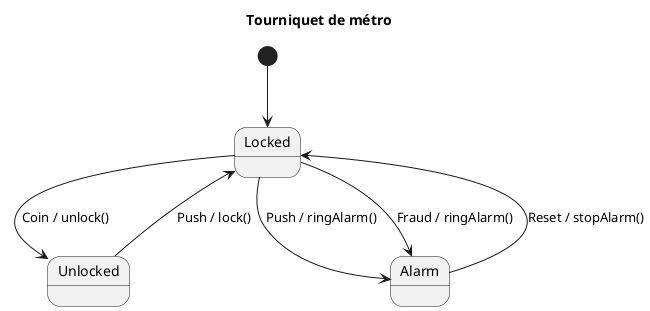

---
tags:
  - exos
  - front
  - exam
---

## Programmation Front 
### Automates d'état et Tables de transition
#### Historique 
##### Exo 1
On dispose de 4 boutons numérotés de 1 à 4.
- Cliquer sur le bouton **n** active le bouton **n+1** et désactive le bouton **n**.
- Cliquer sur le bouton **4** active le bouton **1**.
![[Pasted image 20250916152128.png]]
###### **Automate d'état** : 

###### Table de transition (Matrice État / Événement)

| État | CB1  | CB2  | CB3  | CB4  |
| ---- | ---- | ---- | ---- | ---- |
| E1   | ⇒ E2 | X    | X    | X    |
| E2   | X    | ⇒ E3 | X    | X    |
| E3   | X    | X    | ⇒ E4 | X    |
| E4   | X    | X    | X    | ⇒ E1 |
##### Exo 2 
On dispose de 4 boutons numérotés de 1 à 4.
- Cliquer sur les boutons 1 et 2 active les boutons 3 et 4 et désactivent les boutons 1 et 2.
- Et vice vers ça
![[Pasted image 20250916153028.png]]
###### **Automate d'état**

###### Table de transition (Matrice État / Événement)

| État | CB1       | CB2       | CB3       | CB4       |
|------|-----------|-----------|-----------|-----------|
| E1   | ⇒ E2 a1   | ⇒ E3 a2   | X         | X         |
| E2   | ⇒ E2      | ⇒ E4 a0   | X         | X         |
| E3   | ⇒ E4 a0   | ⇒ E3      | X         | X         |
| E4   | X         | X         | ⇒ E5 a3   | ⇒ E6 a4   |
| E5   | X         | X         | ⇒ E5      | ⇒ E1 a0   |
| E6   | X         | X         | ⇒ E1 a0   | ⇒ E6      |

##### Exo 3 - à faire
##### Exo 4
On dispose d'une fenêtre permettant de faire un compte à rebours avant et arrière, Bornés entre 0 et 20 , un bouton start et stop, et un afficheur de numero

![[Pasted image 20250916153553.png]]
###### **Automate d'état**

###### Table de transition (Matrice État / Événement)

| État            | CStart     | CStop      | timer            | CFWD       | CBWD       |
|-----------------|------------|------------|------------------|------------|------------|
| E1 (Idle)       | ⇒ E2       | X          | a0()             | X          | X          |
| E2 (Forward)    | X          | ⇒ E1       | ⇒ E2 / cpt += 1  | X          | ⇒ E3       |
| E3 (Backward)   | X          | ⇒ E1       | ⇒ E3 / cpt -= 1  | ⇒ E2       | X          |

##### Exo 5

Dans cet exercice plus complexe, on gère deux modes de fonctionnement du feu : **Marche** et **Panne**, avec possibilité de basculer entre eux.
![[36b104e6-17c9-4575-83a4-89b2a1f46c80.png]]
**Événements disponibles :**
- `CStart` : démarrage (active l’état initial du mode courant).
- `CStop` : arrêt (retour à l’état _Off_ depuis n’importe quel état).
- `CPanne` : bascule entre _Marche_ et _Panne_.
- `tr`, `to`, `tv` : timers associés aux phases Rouge, Orange et Vert.
- `tpo`, `tpe` : timers associés aux états Panne (Orange allumé/éteint).

**Règles :**

- En mode **Marche**, le cycle suit _Rouge → Orange → Vert → Rouge_, avec déclenchement basé sur `tr`, `to`, `tv`.
    
- En mode **Panne**, le feu alterne _OrangeOn ↔ OrangeOff_ avec `tpo` et `tpe`.
    
- `CStop` ramène toujours à l’état _Off_.
    
- `CPanne` provoque un basculement immédiat vers l’état initial du mode opposé.
    

Un **automate d’état** doit être construit pour représenter ces comportements.
###### Automate d'état 

#### Exos à faire
On modélise un **tourniquet de métro** (barrière d’accès).

- **États possibles :**
    
    - **Verrouillé** (personne ne peut passer).
        
    - **Déverrouillé** (une personne peut passer).
        
    - **Alarme** (si fraude).
        
- **Événements :**
    
    - `Coin` : un voyageur insère un ticket/pièce.
        
    - `Push` : un voyageur pousse la barrière.
        
    - `Fraud` : un voyageur force le passage sans payer.
        
    - `Reset` : un agent réinitialise le système.
        
- **Actions :**
    
    - `unlock()` : ouvrir la barrière.
        
    - `lock()` : refermer la barrière.
        
    - `ringAlarm()` : déclencher l’alarme.
        
    - `stopAlarm()` : arrêter l’alarme.
        
- **Règles de fonctionnement :**
    
    - Au départ, le tourniquet est **Verrouillé**.
        
    - Si l’on insère un **ticket (Coin)**, il se **déverrouille** (`unlock()`).
        
    - Si on pousse la barrière (**Push**) alors qu’elle est déverrouillée, on passe → retour en **Verrouillé** (`lock()`).
        
    - Si on pousse sans ticket (**Push** en Verrouillé), l’**alarme** se déclenche (`ringAlarm()`).
        
    - Un agent peut **Reset** depuis l’alarme pour revenir en Verrouillé (`stopAlarm()`).

###### Automate :

### Diagrammes de composants personalisés
#### Historique

##### Exo 1

On souhaite modéliser une **application de gestion et de tri des produits**.  
L’interface propose plusieurs éléments de filtrage :

- Un **champ de recherche textuel** permettant de saisir un motif pour filtrer les produits affichés.
    
- Une **case à cocher** permettant de choisir si l’on souhaite afficher uniquement les produits en stock.
    
- Un **slider (curseur)** permettant de définir un **prix maximal** afin de restreindre la liste affichée.
    
![[Pasted image 20250909144346.png]]
L’utilisateur peut donc combiner ces trois filtres pour explorer le catalogue. Chaque composant de l’IHM déclenche un événement (`OnChange`) qui est centralisé dans le composant parent `SearchBar`, lequel se charge d’émettre les signaux de mise à jour vers la partie affichage de l’application.

Ici la modélisation :  
![[Pasted image 20250909150832.png]]

---

##### Exo 2

On modélise une **application avec quatre boutons** représentant les **saisons** : _Spring, Summer, Fall, Winter_.

- Chaque bouton correspond à une transition vers une saison spécifique (`toSpring`, `toSummer`, `toFall`, `toWinter`).
    
- Lorsqu’un bouton est cliqué (`onClick`), un événement est envoyé au composant parent `Dialog`.
    
- Le `Dialog` centralise les états et gère l’affichage de la saison courante grâce à un label relié par un adaptateur.
    
- Certains boutons peuvent être désactivés selon le contexte (par exemple : `Enabled = false`).
    
![[Pasted image 20250917104847.png]]
L’objectif est de représenter l’interaction entre les composants d’IHM (boutons, label) et le cœur de l’application (`Dialog`), ainsi que le rôle de l’adaptateur qui transforme les données avant l’affichage.

Ici la modélisation :  
![[Pasted image 20250916115706.png]]
#### Exos à faire

##### Exo 3 — Barre de filtres des tâches

**Énoncé.** Modéliser une barre de filtres pour une liste de tâches : recherche textuelle, affichage « terminées uniquement », et priorité maximale. Les trois entrées doivent notifier un composant central qui diffuse les changements au tableau.

**Corrigé (liste).**

- **Composants**
    
    - `TaskFilterBar` (central)
        
    - `Input Search`
        
    - `Checkbox CompletedOnly`
        
    - `Range MaxPriority`
        
    - `TasksTable`
        
- **Attributs**
    
    - `Input Search` : `Placeholder`, `Text`
        
    - `Checkbox CompletedOnly` : `Checked`, `Label`
        
    - `Range MaxPriority` : `min`, `max`, `value`, `labelText`
        
    - `TaskFilterBar` : (—)
        
    - `TasksTable` : (—)
        
- **Liens / Événements**
    
    - `Input Search` — `onChange(String)` → `TaskFilterBar` (event : `SearchPatternChange`)
        
    - `Checkbox CompletedOnly` — `onChange(Boolean)` → `TaskFilterBar` (event : `CompletedOnlyChange`)
        
    - `Range MaxPriority` — `onChange(Number)` → `TaskFilterBar` (event : `MaxPriorityChange`)
        
    - `TaskFilterBar` → `TasksTable` (events : `SearchPatternChange`, `CompletedOnlyChange`, `MaxPriorityChange`)
        

---

##### Exo 4 — Contrôles audio basiques

**Énoncé.** Modéliser les contrôles d’un mini-lecteur : boutons **Play**, **Pause**, **Stop**, un **slider Volume**, et un **Label** affichant l’état courant via un adaptateur.

**Corrigé (liste).**

- **Composants**
    
    - `Player` (central)
        
    - `Button Play`, `Button Pause`, `Button Stop`
        
    - `Range Volume`
        
    - `Label State`
        
    - `Adapter` (formatte l’état en texte)
        
- **Attributs**
    
    - `Button *` : `Enabled`, `Label`
        
    - `Range Volume` : `min`, `max`, `value`, `labelText`
        
    - `Label State` : `Label`
        
    - `Player` : (—) ; `Adapter` : (—)
        
- **Liens / Événements**
    
    - `Button Play` — `onClick`/`toPlay` → `Player`
        
    - `Button Pause` — `onClick`/`toPause` → `Player`
        
    - `Button Stop` — `onClick`/`toStop` → `Player`
        
    - `Range Volume` — `onChange(Number)`/`volumeChange` → `Player`
        
    - `Player` — `stateChange(String)` → `Adapter` → `Label State`
        
    - (optionnel) `Player` — `setPauseEnabled(Boolean)` → `Button Pause`
        

---

##### Exo 5 — Modal de confirmation

**Énoncé.** Modéliser une fenêtre modale ouverte par un bouton **Open**. Dans la modale : **Confirm**, **Cancel**, une case **Don’t ask again**. Le label d’état affiche la dernière action via un adaptateur. Le bouton **Confirm** peut être (dés)activé par la modale.

**Corrigé (liste).**

- **Composants**
    
    - `Modal` (central)
        
    - `Button Open`, `Button Confirm`, `Button Cancel`
        
    - `Checkbox DontAskAgain`
        
    - `Label Status`
        
    - `Adapter`
        
- **Attributs**
    
    - `Button *` : `Enabled`, `Label`
        
    - `Checkbox DontAskAgain` : `Checked`, `Label`
        
    - `Label Status` : `Label`
        
    - `Modal`, `Adapter` : (—)
        
- **Liens / Événements**
    
    - `Button Open` — `onClick`/`open` → `Modal`
        
    - `Button Confirm` — `onClick`/`confirm` → `Modal`
        
    - `Button Cancel` — `onClick`/`cancel` → `Modal`
        
    - `Checkbox DontAskAgain` — `onChange(Boolean)`/`prefChange` → `Modal`
        
    - `Modal` — `statusChange(String)` → `Adapter` → `Label Status`
        
    - `Modal` — `setConfirmEnabled(Boolean)` → `Button Confirm`
        

---

##### Exo 6 — Sélecteur de devise

**Énoncé.** Modéliser un sélecteur de devise avec trois boutons **EUR/USD/GBP**, un **input montant**, et un **label** qui affiche « {amount} {currency} » via adaptateur. Le composant central gère la devise sélectionnée et le montant.

**Corrigé (liste).**

- **Composants**
    
    - `CurrencyDialog` (central)
        
    - `Button EUR`, `Button USD`, `Button GBP`
        
    - `Input Amount`
        
    - `Label Preview`
        
    - `Adapter`
        
- **Attributs**
    
    - `Button *` : `Enabled`, `Label`
        
    - `Input Amount` : `Placeholder`, `Text` (numérique)
        
    - `Label Preview` : `Label`
        
    - `CurrencyDialog`, `Adapter` : (—)
        
- **Liens / Événements**
    
    - `Button EUR` — `onClick`/`toEUR` → `CurrencyDialog`
        
    - `Button USD` — `onClick`/`toUSD` → `CurrencyDialog`
        
    - `Button GBP` — `onClick`/`toGBP` → `CurrencyDialog`
        
    - `Input Amount` — `onChange(String|Number)`/`amountChange` → `CurrencyDialog`
        
    - `CurrencyDialog` — `previewChange(String)` → `Adapter` → `Label Preview`
        
    - (optionnel) `CurrencyDialog` — `setButtonEnabled(Boolean)` → `Button *` (selon règles métier)