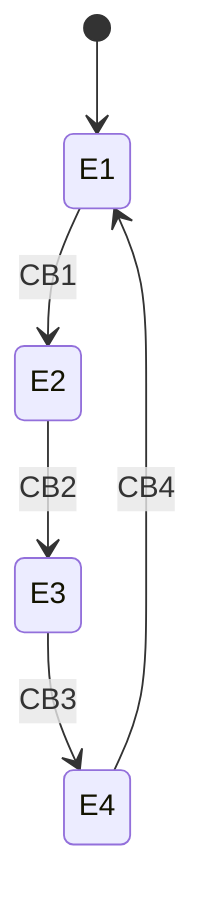
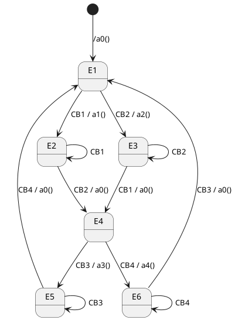
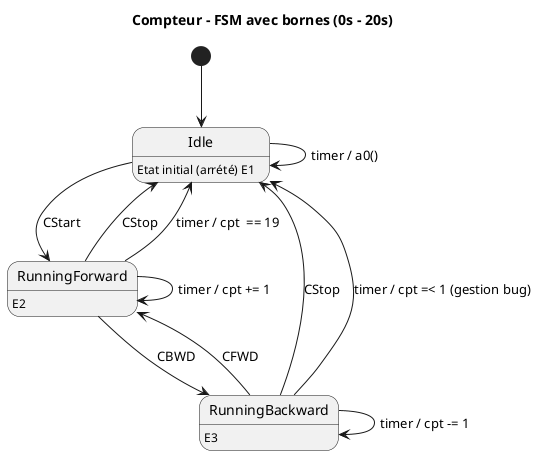
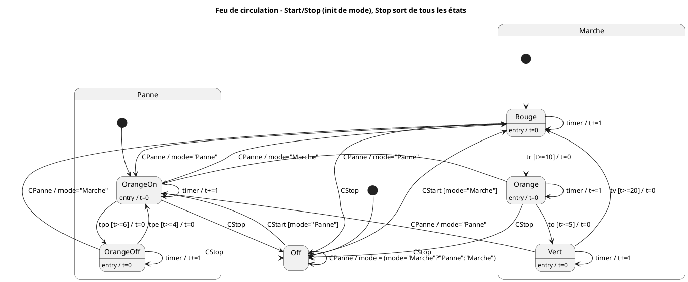
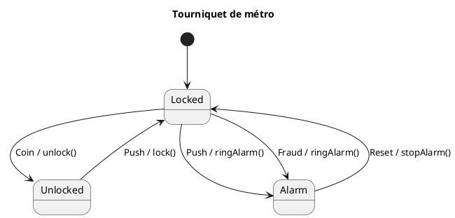
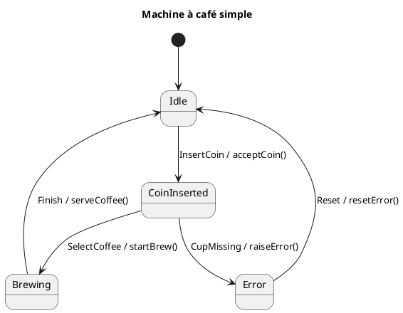
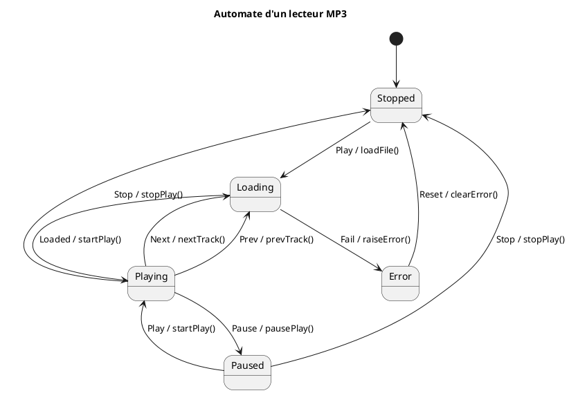
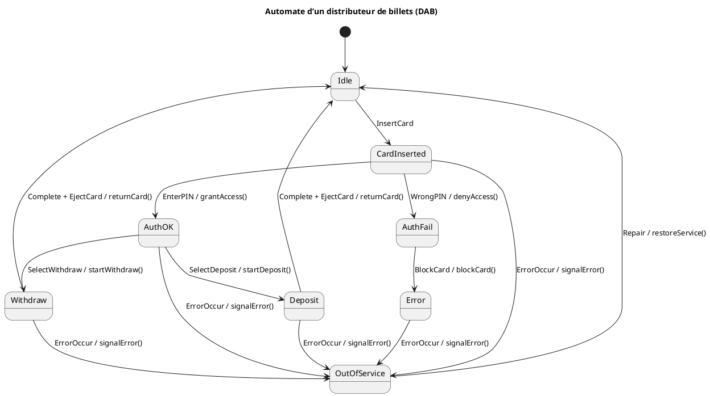
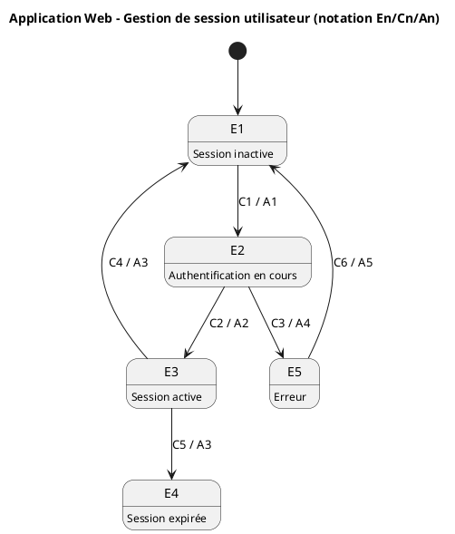

---
tags:
  - exos
  - front
  - exam
---

## Programmation Front 
### Automates d'état et Tables de transition
#### Historique 
##### Exo 1
On dispose de 4 boutons numérotés de 1 à 4.
- Cliquer sur le bouton **n** active le bouton **n+1** et désactive le bouton **n**.
- Cliquer sur le bouton **4** active le bouton **1**.
![[Pasted image 20250916152128.png]]
###### **Automate d'état** : 

###### Table de transition (Matrice État / Événement)

| État | CB1  | CB2  | CB3  | CB4  |
| ---- | ---- | ---- | ---- | ---- |
| E1   | ⇒ E2 | X    | X    | X    |
| E2   | X    | ⇒ E3 | X    | X    |
| E3   | X    | X    | ⇒ E4 | X    |
| E4   | X    | X    | X    | ⇒ E1 |
##### Exo 2 
On dispose de 4 boutons numérotés de 1 à 4.
- Cliquer sur les boutons 1 et 2 active les boutons 3 et 4 et désactivent les boutons 1 et 2.
- Et vice vers ça
![[Pasted image 20250916153028.png]]
###### **Automate d'état**

###### Table de transition (Matrice État / Événement)

| État | CB1       | CB2       | CB3       | CB4       |
|------|-----------|-----------|-----------|-----------|
| E1   | ⇒ E2 a1   | ⇒ E3 a2   | X         | X         |
| E2   | ⇒ E2      | ⇒ E4 a0   | X         | X         |
| E3   | ⇒ E4 a0   | ⇒ E3      | X         | X         |
| E4   | X         | X         | ⇒ E5 a3   | ⇒ E6 a4   |
| E5   | X         | X         | ⇒ E5      | ⇒ E1 a0   |
| E6   | X         | X         | ⇒ E1 a0   | ⇒ E6      |

##### Exo 3 - à faire
##### Exo 4
On dispose d'une fenêtre permettant de faire un compte à rebours avant et arrière, Bornés entre 0 et 20 , un bouton start et stop, et un afficheur de numero

![[Pasted image 20250916153553.png]]
###### **Automate d'état**

###### Table de transition (Matrice État / Événement)

| État            | CStart     | CStop      | timer            | CFWD       | CBWD       |
|-----------------|------------|------------|------------------|------------|------------|
| E1 (Idle)       | ⇒ E2       | X          | a0()             | X          | X          |
| E2 (Forward)    | X          | ⇒ E1       | ⇒ E2 / cpt += 1  | X          | ⇒ E3       |
| E3 (Backward)   | X          | ⇒ E1       | ⇒ E3 / cpt -= 1  | ⇒ E2       | X          |

##### Exo 5

Dans cet exercice plus complexe, on gère deux modes de fonctionnement du feu : **Marche** et **Panne**, avec possibilité de basculer entre eux.
![[36b104e6-17c9-4575-83a4-89b2a1f46c80.png]]
**Événements disponibles :**
- `CStart` : démarrage (active l’état initial du mode courant).
- `CStop` : arrêt (retour à l’état _Off_ depuis n’importe quel état).
- `CPanne` : bascule entre _Marche_ et _Panne_.
- `tr`, `to`, `tv` : timers associés aux phases Rouge, Orange et Vert.
- `tpo`, `tpe` : timers associés aux états Panne (Orange allumé/éteint).

**Règles :**

- En mode **Marche**, le cycle suit _Rouge → Orange → Vert → Rouge_, avec déclenchement basé sur `tr`, `to`, `tv`.
    
- En mode **Panne**, le feu alterne _OrangeOn ↔ OrangeOff_ avec `tpo` et `tpe`.
    
- `CStop` ramène toujours à l’état _Off_.
    
- `CPanne` provoque un basculement immédiat vers l’état initial du mode opposé.
    

Un **automate d’état** doit être construit pour représenter ces comportements.
###### Automate d'état 

#### Exos à faire
##### Exo1
On modélise un **tourniquet de métro** (barrière d’accès).

- **États possibles :**
    
    - **Verrouillé** (personne ne peut passer).
        
    - **Déverrouillé** (une personne peut passer).
        
    - **Alarme** (si fraude).
        
- **Événements :**
    
    - `Coin` : un voyageur insère un ticket/pièce.
        
    - `Push` : un voyageur pousse la barrière.
        
    - `Fraud` : un voyageur force le passage sans payer.
        
    - `Reset` : un agent réinitialise le système.
        
- **Actions :**
    
    - `unlock()` : ouvrir la barrière.
        
    - `lock()` : refermer la barrière.
        
    - `ringAlarm()` : déclencher l’alarme.
        
    - `stopAlarm()` : arrêter l’alarme.
        
- **Règles de fonctionnement :**
    
    - Au départ, le tourniquet est **Verrouillé**.
        
    - Si l’on insère un **ticket (Coin)**, il se **déverrouille** (`unlock()`).
        
    - Si on pousse la barrière (**Push**) alors qu’elle est déverrouillée, on passe → retour en **Verrouillé** (`lock()`).
        
    - Si on pousse sans ticket (**Push** en Verrouillé), l’**alarme** se déclenche (`ringAlarm()`).
        
    - Un agent peut **Reset** depuis l’alarme pour revenir en Verrouillé (`stopAlarm()`).

###### Automate :

##### Exo 2
On veut modéliser une **machine à café automatique** :

- **États :**
    
    - **Idle** : en attente d’un client.
        
    - **CoinInserted** : une pièce est insérée, attente du choix.
        
    - **Brewing** : préparation du café.
        
    - **Error** : erreur (p. ex. plus de gobelets).
        
- **Événements :**
    
    - `InsertCoin` : le client met une pièce.
        
    - `SelectCoffee` : le client appuie sur un bouton café.
        
    - `CupMissing` : la machine détecte qu’il n’y a pas de gobelet.
        
    - `Finish` : fin de préparation.
        
    - `Reset` : intervention du technicien pour réinitialiser.
        
- **Actions :**
    
    - `acceptCoin()` : valider la pièce.
        
    - `startBrew()` : lancer la préparation.
        
    - `serveCoffee()` : délivrer le café.
        
    - `raiseError()` : passer en erreur.
        
    - `resetError()` : corriger l’erreur.
###### Automate

##### Exo 3
On veut modéliser un petit lecteur de musique.

##### États

- **Stopped** : aucun morceau n’est en cours.
    
- **Playing** : lecture d’un morceau.
    
- **Paused** : morceau en pause.
    
- **Loading** : chargement d’un fichier audio.
    
- **Error** : erreur de lecture (fichier corrompu).
    

##### Événements

- `Play` : démarrer la lecture ou reprendre après une pause.
    
- `Pause` : mettre en pause.
    
- `Stop` : arrêter.
    
- `Next` : passer au morceau suivant.
    
- `Prev` : morceau précédent.
    
- `Loaded` : fichier chargé avec succès.
    
- `Fail` : échec de chargement.
    
- `Reset` : réinitialiser après erreur.
    

##### Contraintes

- Depuis l’état **Paused**, on ne peut **pas** utiliser `Next` ni `Prev` (on ne peut que reprendre `Play` ou `Stop`).
    
- Depuis l’état **Error**, on ne peut **pas** utiliser `Next` ni `Prev` non plus (on ne peut que `Reset`).
    

##### Actions

- `startPlay()` : lancer la lecture.
    
- `pausePlay()` : mettre en pause.
    
- `stopPlay()` : arrêter la lecture.
    
- `loadFile()` : charger un fichier audio.
    
- `nextTrack()` : morceau suivant.
    
- `prevTrack()` : morceau précédent.
    
- `raiseError()` : passer en erreur.
    
- `clearError()` : corriger l’erreur

##### Exo 4 
On veut modéliser le fonctionnement d’un DAB classique.

##### États

- **Idle** : en attente d’un client.
    
- **CardInserted** : carte insérée, attente du code PIN.
    
- **AuthOK** : authentification réussie, choix d’une opération.
    
- **AuthFail** : échec d’authentification.
    
- **Withdraw** : retrait en cours.
    
- **Deposit** : dépôt en cours.
    
- **Error** : erreur (carte bloquée, panne, etc.).
    
- **OutOfService** : distributeur hors service.
    

##### Événements

- `InsertCard` : insertion d’une carte.
    
- `EnterPIN` : saisie correcte du code.
    
- `WrongPIN` : saisie incorrecte du code.
    
- `SelectWithdraw` : choix de retrait.
    
- `SelectDeposit` : choix de dépôt.
    
- `Complete` : opération terminée.
    
- `EjectCard` : retour de la carte.
    
- `BlockCard` : blocage de la carte.
    
- `ErrorOccur` : panne matérielle.
    
- `Repair` : remise en service.
    

##### Contraintes

1. Depuis **Idle**, seule une insertion de carte est possible.
    
2. Depuis **CardInserted**, il faut obligatoirement valider un PIN correct pour continuer ; trois `WrongPIN` déclenchent `BlockCard` et mènent à **Error**.
    
3. Depuis **AuthOK**, seul un choix d’opération est permis (`Withdraw` ou `Deposit`).
    
4. Une fois l’opération terminée, on revient à **Idle** après `EjectCard`.
    
5. En cas de panne (`ErrorOccur`), le système bascule en **OutOfService**, seule l’action `Repair` le ramène à **Idle**.
    

##### Actions

- `checkPIN()` : vérifier le code.
    
- `grantAccess()` : donner accès au menu.
    
- `denyAccess()` : refuser.
    
- `startWithdraw()` : lancer un retrait.
    
- `startDeposit()` : lancer un dépôt.
    
- `returnCard()` : rendre la carte.
    
- `blockCard()` : bloquer la carte.
    
- `signalError()` : signaler une panne.
    
- `restoreService()` : remettre en marche.
  ###### Automate 

##### Exo 5 : 
On modélise une application web classique (par ex. un site e-commerce).  
Un utilisateur peut naviguer, se connecter, et se déconnecter. Le système gère aussi les erreurs de session et le temps d’expiration.

##### États (En)

- **E1** : Session inactive (utilisateur non connecté).
    
- **E2** : Authentification en cours (login en traitement).
    
- **E3** : Session active (utilisateur connecté).
    
- **E4** : Session expirée (timeout).
    
- **E5** : Erreur (mauvais identifiants, bug, etc.).
    

##### Événements (Cn)

- **C1** : Demande de login (formulaire soumis).
    
- **C2** : Authentification réussie.
    
- **C3** : Authentification échouée.
    
- **C4** : Déconnexion manuelle.
    
- **C5** : Timeout (session trop longue).
    
- **C6** : Reset après erreur.
    

##### Actions (An)

- **A1** : Vérifier identifiants.
    
- **A2** : Créer session utilisateur.
    
- **A3** : Fermer session utilisateur.
    
- **A4** : Déclencher message d’erreur.
    
- **A5** : Nettoyer et réinitialiser.
    

---

👉 Exemple de transitions :

- `E1 --C1/A1--> E2` : depuis “non connecté”, on soumet le login, l’appli vérifie les identifiants.
    
- `E2 --C2/A2--> E3` : si c’est correct, création de session → utilisateur connecté.
    
- `E2 --C3/A4--> E5` : si c’est faux, on bascule en erreur.
    
- `E3 --C4/A3--> E1` : déconnexion.
    
- `E3 --C5/A3--> E4` : session expirée automatiquement.
    
- `E5 --C6/A5--> E1` : reset pour revenir à l’état initial.

###### Automate

### Diagrammes de composants personalisés
#### Historique
##### EX1 
###### Description de l'application

![[Pasted image 20250909144346.png]]
###### Modèle 

![[Pasted image 20250909150832.png]]
##### Exo 2
Description de l'application 
![[Pasted image 20250916115842.png]]

###### Modèle
Le diagramme correspond à un **pattern Adapter**.

- La classe **Adapter** est présente explicitement (rectangle rose).
    
- Les boutons (Spring, Summer, Fall, Winter) envoient des événements (`onClick → toSpring`, `toSummer`, etc.) vers un composant principal (**Dialog**).
    
- L’**Adapter** sert d’intermédiaire pour **traduire l’appel** entre la source (les boutons, labels) et la cible (Dialog qui affiche la saison).
    

C’est exactement le rôle du **design pattern Adapter** :

- **But** : faire en sorte que des classes qui n’ont pas la même interface puissent collaborer.
    
- Ici, les **boutons** exposent une interface (onClick), et le **Dialog** attend des appels (`displaySeason`). L’Adapter s’interpose pour convertir les appels et les relier.
![[Pasted image 20250916115706.png]]
#### Exos à faire :
##### Exo1
### Composants attendus

- **LoginForm** (conteneur principal).
    
- **InputUsername** (zone de saisie du nom d’utilisateur).
    
- **InputPassword** (zone de saisie du mot de passe).
    
- **CheckboxRememberMe** (mémoriser l’utilisateur).
    
- **ButtonLogin** (bouton de connexion).
    
- **MenuHelp** (menu d’aide ou “Mot de passe oublié ?”).
    

### Connecteurs

- `InputUsername --> LoginForm` (appartient au formulaire).
    
- `InputPassword --> LoginForm`.
    
- `CheckboxRememberMe --> LoginForm`.
    
- `ButtonLogin --> LoginForm`.
    
- `MenuHelp --> LoginForm`.
    

Quand l’utilisateur clique sur **ButtonLogin**, le **LoginForm** envoie les infos au **Controller** (non représenté ici, hors périmètre).

