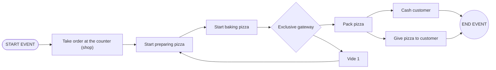
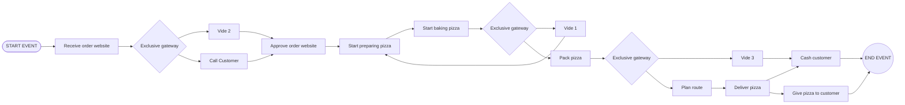
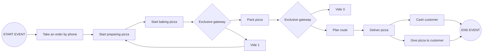

---
tags:
  - BPMN
  - exos
---

  

## Liste des BPMNs

### **Modélisation du processus global de gestion des commandes**

On vous demande de **modéliser le processus complet de gestion des commandes**, en fusionnant les **trois modes de commande** utilisés dans l’établissement :

1. **Commande sur place**
    
2. **Commande à emporter**
    
3. **Commande avec livraison**
    

Votre modèle devra intégrer l’ensemble des **informations nécessaires au traitement d’une commande**, notamment :

- informations sur les pizzas :
    
    - nom
        
    - taille
        
    - prix
        
- informations sur la commande :
    
    - prix total
        
    - mode de paiement
        
- informations sur le client :
    
    - nom
        
    - prénom
        
    - adresse (uniquement si livraison)
        

Les **acteurs** intervenant dans le processus sont :

- le **gérant** : reçoit la commande, contacte le client si nécessaire, approuve la commande, remet et encaisse les commandes récupérées sur place
    
- le **pizzaiolo** : prépare les pizzas
    
- le **livreur** : livre les commandes, remet les commandes livrées, et encaisse si nécessaire
    

---

### Event counter

Le client arrive au comptoir et passe sa commande. Le pizzaiolo démarre la préparation, puis lance la cuisson. À la fin de la cuisson, un choix se présente : soit la pizza est jugée insuffisante et on repart en préparation, soit elle est correcte et on passe à l’emballage. Une fois la pizza emballée, le client est encaissé ou bien la pizza lui est remise directement. Dans les deux cas, le processus se termine.

  

  

### Event Internet

  La commande arrive depuis le site web. Selon les informations reçues, le gérant peut appeler le client ou accepter directement la commande. Une fois l’approbation faite, la préparation commence, suivie de la cuisson. Si la cuisson n’est pas satisfaisante, le flux repart en préparation ; sinon, la pizza est emballée. Après l’emballage, on vérifie s’il faut planifier la livraison. Le livreur prend la route, livre la pizza, puis soit encaisse le client soit lui remet simplement la commande. Le processus se termine après la livraison ou l’encaissement.

  

### Event Phone

  
Un client passe commande par téléphone. La préparation démarre immédiatement, puis la pizza est cuite. Après cuisson, on décide si elle doit repartir en préparation ou si elle peut être emballée. Une fois emballée, on choisit soit de la faire livrer (avec planification de route), soit de clore directement. La livraison aboutit soit à la remise de la pizza, soit à l’encaissement. Dans les deux cas, le processus s’achève.

GPT Proposal  de merge :

```mermaid
flowchart LR

%% --- Events ---
n_start(("START EVENT"))
n_end(("END EVENT"))

%% --- Tasks ---
n_counter["Take order at counter"]
n_phone["Take order by phone"]
n_web["Receive order from website"]
n_call["Call customer"]
n_approve["Approve order"]
n_register["Register order"]

n_prep["Start preparing pizza"]
n_bake["Start baking pizza"]
n_pack["Pack pizza"]

n_plan["Plan route"]
n_deliver["Deliver pizza"]

n_give_shop["Give pizza (shop/takeaway)"]
n_cash_shop["Cash customer (shop)"]

n_give_deliv["Give pizza (delivery)"]
n_cash_deliv["Cash customer (delivery)"]

%% --- Gateways ---
n_gw_channel{"Order channel"}
n_gw_ok{"Pizza OK"}
n_gw_delivery{"Delivery?"}

%% --- Sequence Flows ---

n_start --> n_gw_channel

n_gw_channel --> n_counter
n_gw_channel --> n_phone
n_gw_channel --> n_web

n_counter --> n_register
n_phone --> n_register

n_web --> n_call
n_call --> n_approve
n_approve --> n_register

n_register --> n_prep
n_prep --> n_bake
n_bake --> n_gw_ok

n_gw_ok --> n_prep
n_gw_ok --> n_pack

n_pack --> n_gw_delivery

n_gw_delivery --> n_give_shop
n_gw_delivery --> n_plan

n_give_shop --> n_cash_shop
n_cash_shop --> n_end

n_plan --> n_deliver
n_deliver --> n_give_deliv
n_deliver --> n_cash_deliv

n_give_deliv --> n_end
n_cash_deliv --> n_end

```

