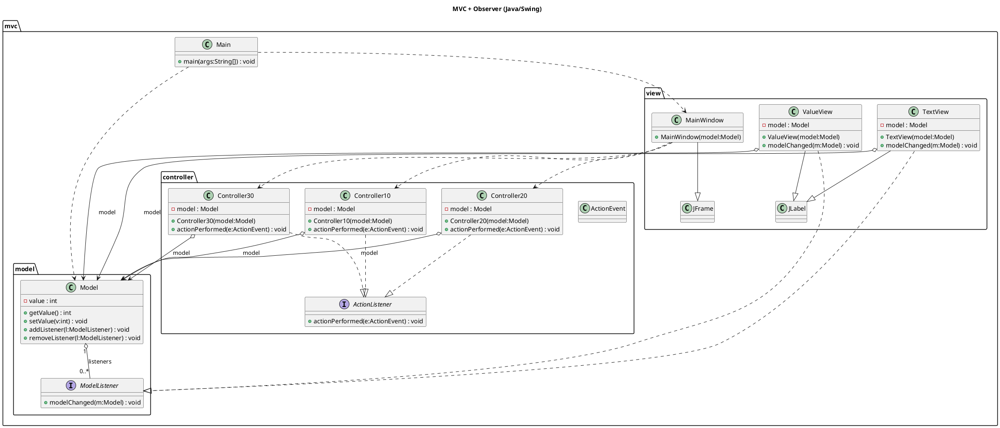

---
tags:
  - exos
  - POO
---
Il s'agit ici d'implementer une application simple en MVC

```puml
@startuml
title MVC + Observer (Java/Swing)

package mvc {
  package model {
    class Model {
      - value : int
      + getValue() : int
      + setValue(v:int) : void
      + addListener(l:ModelListener) : void
      + removeListener(l:ModelListener) : void
    }

    interface ModelListener {
      + modelChanged(m:Model) : void
    }
  }

  package view {
    class JLabel
    class JFrame

    class ValueView {
      - model : Model
      + ValueView(model:Model)
      + modelChanged(m:Model) : void
    }
    class TextView {
      - model : Model
      + TextView(model:Model)
      + modelChanged(m:Model) : void
    }
    class MainWindow {
      + MainWindow(model:Model)
    }

    ValueView --|> JLabel
    TextView  --|> JLabel
    MainWindow --|> JFrame
    ValueView ..|> ModelListener
    TextView  ..|> ModelListener
  }

  package controller {
    interface ActionListener {
      + actionPerformed(e:ActionEvent) : void
    }
    class ActionEvent

    class Controller10 {
      - model : Model
      + Controller10(model:Model)
      + actionPerformed(e:ActionEvent) : void
    }
    class Controller20 {
      - model : Model
      + Controller20(model:Model)
      + actionPerformed(e:ActionEvent) : void
    }
    class Controller30 {
      - model : Model
      + Controller30(model:Model)
      + actionPerformed(e:ActionEvent) : void
    }

    Controller10 ..|> ActionListener
    Controller20 ..|> ActionListener
    Controller30 ..|> ActionListener
  }

  class Main {
    + main(args:String[]) : void
  }
}

' --- Relations clés
Model "1" o-- "0..*" ModelListener : listeners
ValueView o--> Model : model
TextView  o--> Model : model
MainWindow ..> Controller10
MainWindow ..> Controller20
MainWindow ..> Controller30
Controller10 o--> Model : model
Controller20 o--> Model : model
Controller30 o--> Model : model
Main ..> Model
Main ..> MainWindow
@enduml

```
Code : 
