---
tags:
  - back
  - cours
  - exam
---

## Partie 1

### **1. Pré-requis & Organisation**

- Java/POO, SQL/BD, UML, HTML/CSS, notions Web.
    
- 6h cours + 18h TP (3 Java Web + 3 ORM).
    

---

### **2. Architectures**

#### **1-tiers**

Tout sur un serveur.

- simple — centralisé  
    – pas scalable — interface limitée
    

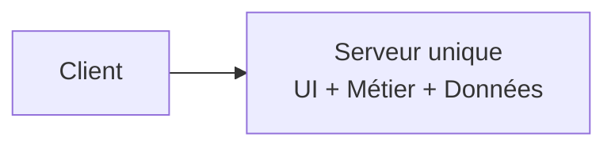

---

#### **2-tiers (client/serveur)**

Client = UI + logique  
Serveur = données

- interface riche  
    – client lourd, couplage fort
    

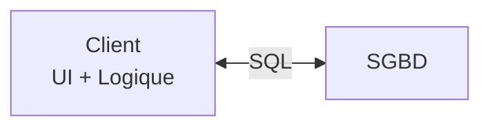

---

#### **3-tiers**

Séparation claire : client / logique métier / BD.

- évolutif, scalable, indépendant
    

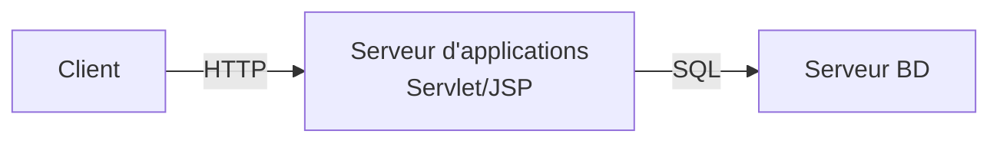

---

#### **n-tiers**

Multiples serveurs (HTML, API, objets métier, BD distribuées).

- montée en charge  
    – complexité/couts
    

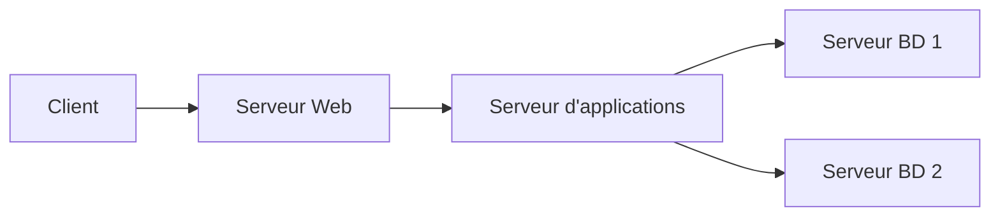

---

#### **Types de clients**

- **Lourd** : installé, riche, dépend OS
    
- **Léger** : navigateur
    
- **Riche** : web + interactions poussées
    

---

### **3. Standards Web**

- **HTML** : structure des pages
    
- **HTTP** : GET/POST/PUT/DELETE
    
- **TCP/IP** : transport + réseau
    
- **CGI** : premiers scripts serveur
    

---

### **4. Pages dynamiques**

#### **Côté client (JS)**

- Interactions, validation, AJAX
    

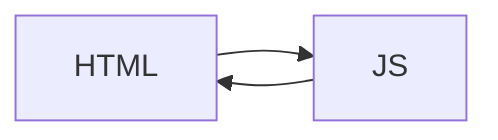

#### **Côté serveur**

- Programme génère HTML dynamique
    
- Accès BD, calculs
    

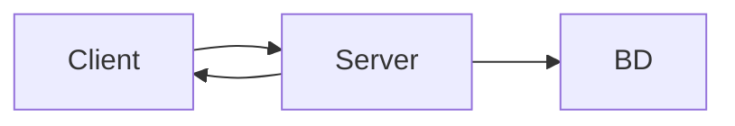

---

### **5. Cycle complet d’une requête HTTP**

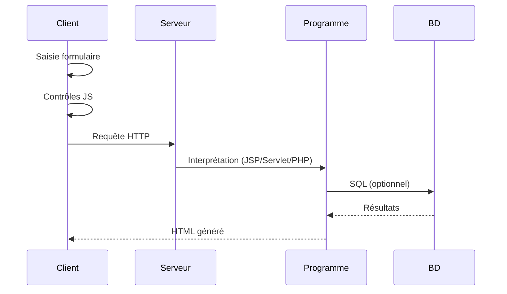

---

### **6. Requêtes HTTP**

- **GET** : paramètres visibles
    
- **POST** : données cachées  
    URL = `protocole://hôte:port/ressource?param=val`
    

---

### **7. Interprétation serveur**

Selon : extension (.jsp/.cgi/.php), répertoire (/servlet/), application.  
Le serveur charge l’environnement et renvoie du HTML.

---

### **8. Exemple JSP (addition)**

#### Formulaire :

```html
<form method="get" action="calculAddition.jsp">
  <input name="nombre1">
  <input name="nombre2">
  <input type="submit" value="Additionner">
</form>
```

#### JSP :

```jsp
La somme est ${param.nombre1 + param.nombre2}
```


## Partie 2 
### **1. Techniques serveur**

CGI (obsolète), ASP.NET, PHP, Servlets/JSP, Node.js.

---

### **2. CGI**

- Interpréteur embarqué, lance **un processus par requête**.
    
- - standard, gratuit, multi-langages.
        
- – aucun état, lourd, lent, surcharge importante.
    
- => amélioré par FastCGI.
    

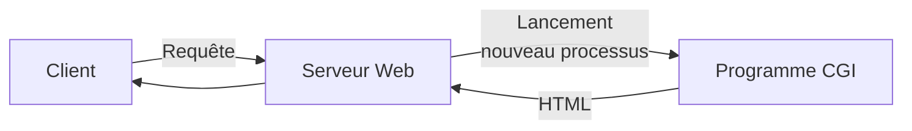

---

## 🧩 **3. Servlets Java**

Programmes Java serveur générant du HTML dynamique.  
→ Comparables aux Applets **sans interface**, **sans contraintes** → accès disque, BD, sockets.

#### **Avantages**

- Portables (Java), compilées, intégrables à de nombreux serveurs web.
    
- Rapides : **instanciées une seule fois**, restent en mémoire.
    
- Multithreading.
    
- Gestion native : cookies, formulaires, sessions.
    
- Mécanismes puissants : chaînage, filtre, partage de données, pool d’instances.
    

---

### **4. Fonctionnement d’une servlet**

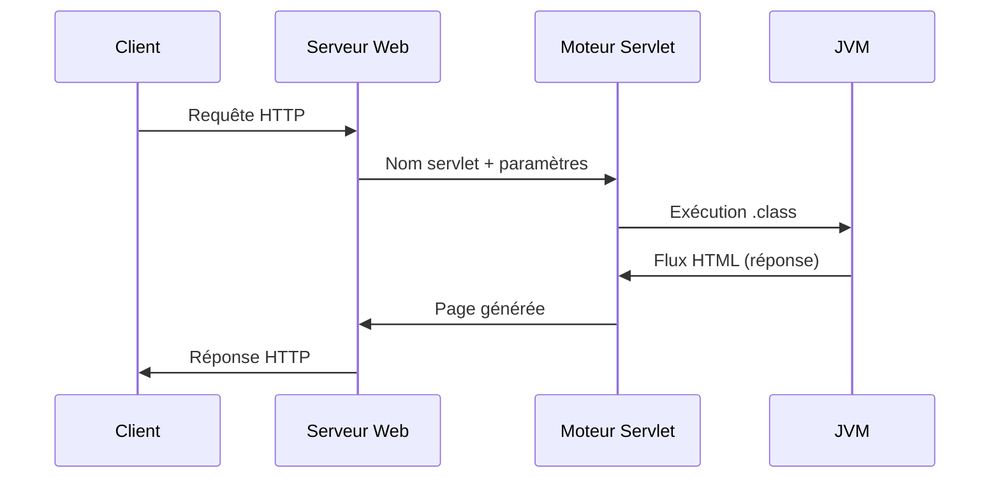

---

### **5. Cycle de vie d’une servlet**

- **Chargement** : au démarrage ou à la 1ère utilisation.
    
- **init()** : initialisation de l’instance.
    
- **Service** : doGet(), doPost() selon type de requête.
    
- **destroy()** : fin de vie (arrêt moteur).
    

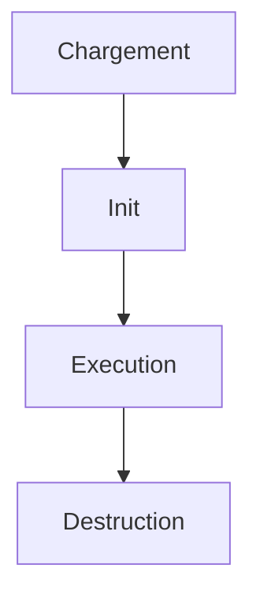

---

### **6. Développement d’une servlet**

Hérite de **HttpServlet** → redéfinit **doGet()** ou **doPost()**.

#### Objets principaux :

- **HttpServletRequest** : form data, headers, cookies, session, méthode HTTP, queryString, User-Agent…
    
- **HttpServletResponse** : type MIME, flux HTML, redirection, cookies.
    

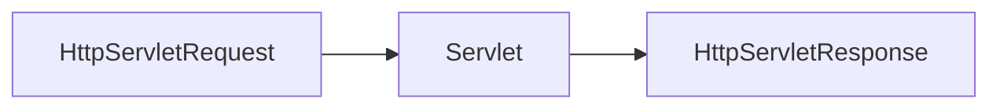

---

### **7. doGet() / doPost() – Exemples**

#### doGet()

Renvoie du HTML simple.

#### doPost()

Récupère paramètres (`request.getParameter`) et génère HTML.

---

## 🌐 **8. JSP (JavaServer Pages)**

Technologie serveur où **HTML est dominant** et **Java s’insère dedans**.  
→ Plus simple pour pages avec beaucoup de statique.

#### **3 types de balises**

- **Scriptlets** `<% %>`
    
- **Directives** `<%@ %>`
    
- **Actions** `<jsp: />`
    

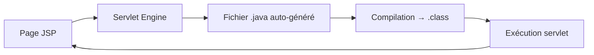

---

### **9. Fonctionnement JSP**

1. Serveur envoie fichier `.jsp` au moteur.
    
2. Moteur transforme JSP → Java.
    
3. Compile en `.class` (servlet).
    
4. Exécution.
    
5. Retour HTML.
    

---

### **10. Objets implicites JSP**

Disponible sans import :

- request, response
    
- session
    
- out
    
- config
    
- application
    

---

### **11. Tags JSP**

#### **Scriptlets**

- `<%= %>` : insérer une expression Java.
    
- `<%! %>` : déclarations persistantes (variables et méthodes).
    
- `<% %>` : code Java exécuté dans la méthode service().
    

#### **Directives**

- **page** (import, errorPage…)
    
- **taglib** (librairies JSTL)
    
- **include** (inclusion lors de la compilation)
    

#### **Actions JSP**

- Manipulation JavaBeans :
    
    - `<jsp:useBean>`
        
    - `<jsp:getProperty>`
        
    - `<jsp:setProperty>`
        
- Inclusion dynamique `<jsp:include>`
    
- Redirection `<jsp:forward>`
    
- Passage de paramètres `<jsp:param>`
    

---

### **12. EL (Expression Language)**

Syntaxe `${ }` simplifiée, remplace beaucoup de scriptlets.

- `${param.nom}`
    
- `${sessionScope.user.login}`
    
- `${cookie.theme.value}`
    

---

## 📌 **SCHÉMA GLOBAL — Servlets + JSP (détaillé)**

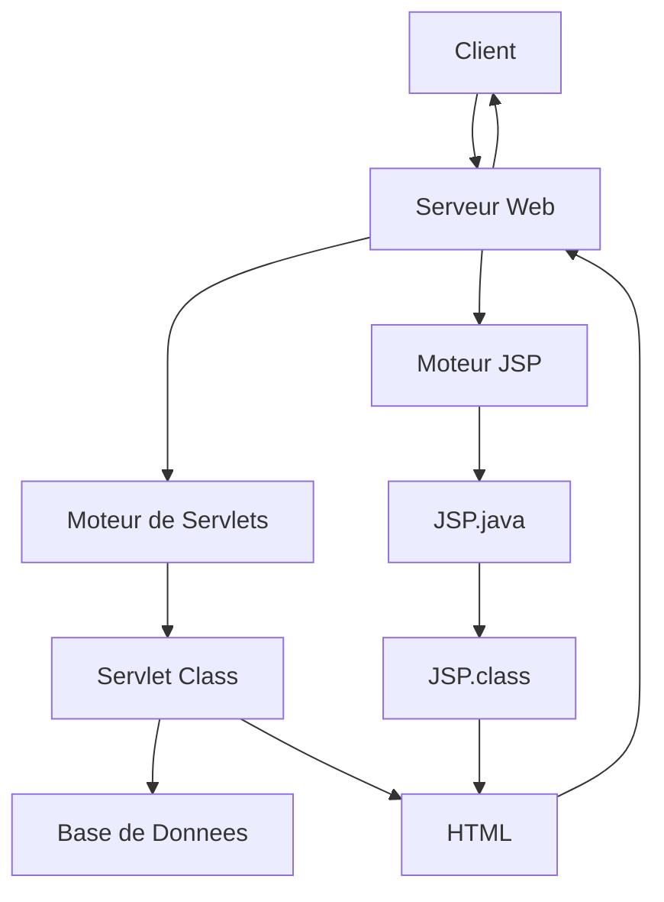

---
Reçu Adam.  
Je te fais un **résumé compressé sans perte d’infos**, clair, propre, puis **tous les schémas en Mermaid 100 % valides (incassables)**.  
Pas de HTML, pas de caractères spéciaux, labels simples → ça passe partout.

## 🧩 **MVC (Model – View – Controller)**

#### **Objectif**

Séparer **métier**, **présentation**, **interaction utilisateur**.  
→ vues multiples, maintenance + tests faciles.

#### **3 acteurs**

- **Modèle (métier + persistance)**
    
    - Traitement des données
        
    - Stockage permanent (BD)
        
    - Restauration d’objets depuis les tables
        
    - Les deux parties doivent rester séparées
        
- **Vue (présentation)**
    
    - Affiche l’état du modèle
        
    - Met en forme
        
    - Se synchronise si le modèle change
        
    - Remonte les entrées utilisateur au contrôleur
        
- **Contrôleur (interaction + orchestration)**
    
    - Reçoit actions utilisateur
        
    - Demande affichage d’une vue
        
    - Met à jour le modèle + déclenche nouvelles vues
        

---

## 🌐 **MVC en développement web Java**

- **Servlet = Contrôleur**
    
    - Reçoit requêtes HTTP
        
    - Extrait données
        
    - Gère session
        
    - Appelle JSP pour affichage
        
- **JSP = Vue**
    
    - Affiche état du modèle (JavaBeans)
        
    - Interaction utilisateur
        
- **JavaBeans = Modèle**
    

---

## 🔀 **Délégation Servlet / JSP**

#### Deux mécanismes :

- **Forward (serveur)**
    
    - `RequestDispatcher rd = request.getRequestDispatcher("url");`
        
    - `rd.forward(request, response);`
        
    - Transparent pour l’utilisateur
        
    - Passage de données : `request.setAttribute()`
        
- **Redirect (client)**
    
    - `response.sendRedirect("url");`
        
    - Visible (changement d’URL)
        
    - Passage via paramètres : `url?nom=valeur`
        

#### Exemples :

- Changer de page selon condition
    
- Passer un objet via :
    
    - request
        
    - session
        

---

## 🗄️ **JDBC (Java DataBase Connectivity)**

#### **But**

API Java universelle pour BD relationnelles via SQL.  
Drivers spécifiques (Oracle, MySQL, Access…).

#### **Étapes JDBC**

1. **Chargement du driver**
    
    - `Class.forName("driver")`
        
2. **Connexion BD**
    
    - `Connection cx = DriverManager.getConnection(url,user,pwd)`
        
3. **Création statement**
    
    - `Statement st = cx.createStatement()`
        
    - Types : Statement / PreparedStatement / CallableStatement
        
4. **Exécution requêtes**
    
    - SELECT → `executeQuery()` → ResultSet
        
    - INSERT/UPDATE/DELETE → `executeUpdate()`
        
5. **Lecture résultat**
    
    - `rs.next()`
        
    - `rs.getXXX("col")` ou `rs.getXXX(index)`
        
6. **Fermeture**
    
    - `rs.close()`, `st.close()`, `cx.close()`
        

#### **Transactions**

- `cx.setAutoCommit(false)`
    
- `cx.commit()` ou `cx.rollback()`
    

#### **Autres services**

- Métadonnées BD → `DatabaseMetaData`
    
- Métadonnées ResultSet → `ResultSetMetaData`
    
- Traitement par lots (batch)
    

---

## 📊 **SCHÉMAS MERMAID 100% VALIDES**

### ✅ **MVC global**

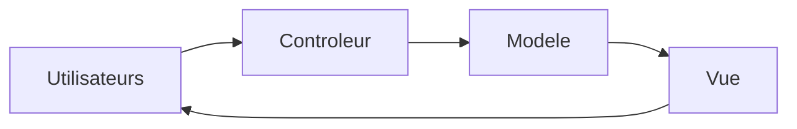

---

### ✅ **MVC Web Java (Servlet / JSP / Bean)**

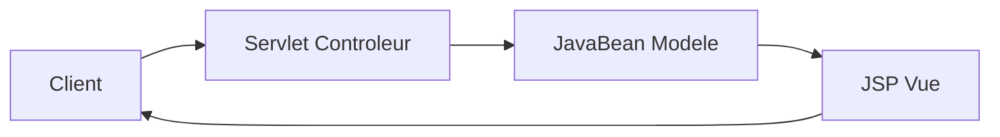

---

### ✅ **Forward vs Redirect**

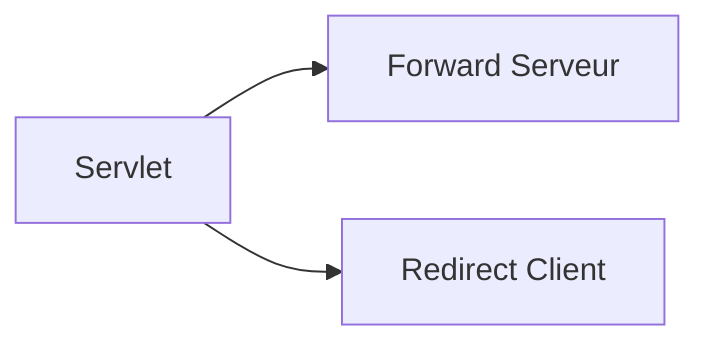

---

### ✅ **JDBC Workflow complet**

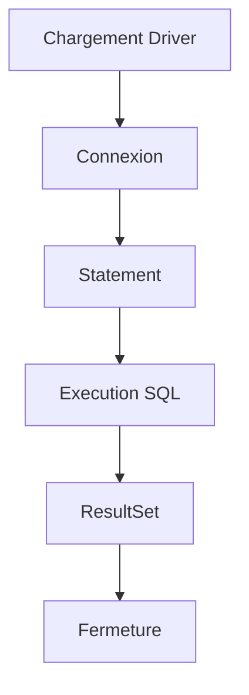

---

### 🔁 **Lifecycle Forward / Passing Data**

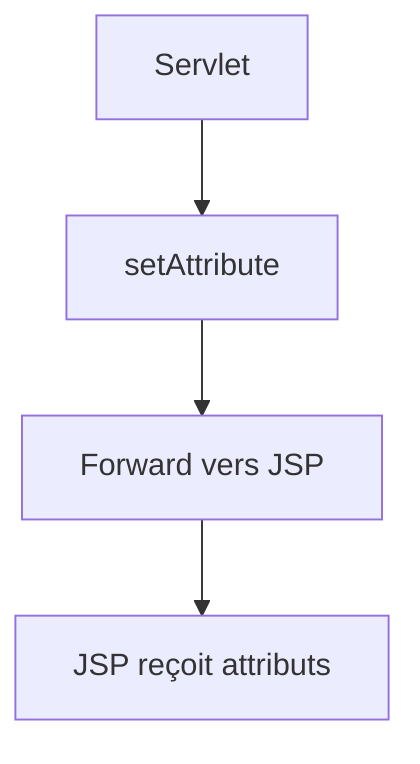

---

### 🔑 **Session-based Data Passing**

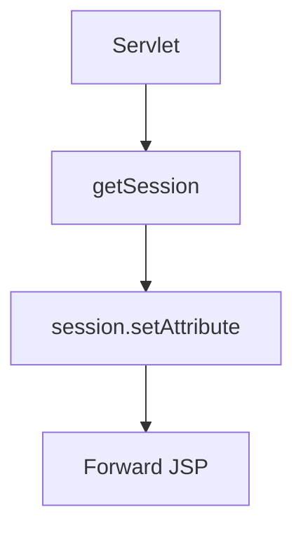

---

### 📡 **JDBC Transaction**

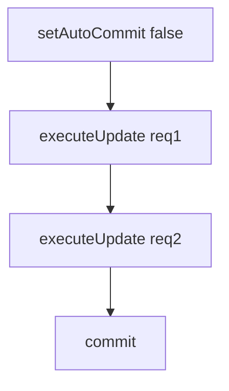

---


## 🍪 **Cookies**

#### **Définition**

- Petits fichiers texte envoyés par le serveur et stockés côté client.
    
- Limites : **4 Ko** par cookie, **300 cookies** par navigateur, **20 par site**.
    

#### **Utilité**

- Paramètres utilisateurs
    
- Auto-complétion (login, adresse…)
    
- Suivi (dernière visite, fréquence…)
    

#### **Sécurité**

- Pas de virus possible
    
- ❗ Infos non chiffrées → sensibles
    

#### **Gestion en Servlet**

- Création : `new Cookie(nom, valeur)`
    
- Dépôt : `response.addCookie(cookie)`
    
- Lecture : `request.getCookies()`
    
- Méthodes : get/setName, get/setValue, get/setMaxAge
    

---

### **Schéma Cookies**

```mermaid
flowchart LR
A[Servlet] --> B[Creation Cookie]
B --> C[addCookie]
C --> D[Navigateur Client]
D --> E[Next HTTP Request]
E --> A
```

---

## 🧭 **Suivi de Session**

#### **Problème**

HTTP est **sans état** → le serveur ne sait pas si plusieurs requêtes viennent du même utilisateur.  
Nécessaire pour caddie, paniers, connexions…

#### **Solutions**

- Cookie
    
- Paramètres URL
    
- Champs cachés `<input type="hidden">`
    
- **HttpSession (solution la plus propre)**
    

#### **HttpSession**

Objet contenant toutes les données utilisateur :

- Types primitifs ou objets
    
- Requêtes d’un même client reliées entre elles
    
- Pas besoin de déclarer dans chaque page
    

#### **Méthodes**

- Récupération : `getSession(true/false)`
    
- Ajouter : `setAttribute("nom", objet)`
    
- Lire : `getAttribute("nom")`
    

---

### **Schéma Session (HttpSession)**

```mermaid
flowchart TD
A[Client] --> B[Servlet 1]
B --> C[Session]
A --> D[Servlet 2]
D --> C
C --> E[JSP Vue]
E --> A
```

---

## 💥 **Exceptions en Java**

#### **Définition**

Événement interrompant le flot normal du programme.  
Causes : division par zéro, SQL, chargement impossible, mémoire…

Sans gestion : crash + ressources non libérées.

#### **Avantages du système d’exception**

- Séparation code normal / code erreur
    
- Propagation possible
    
- Classement par type (RuntimeException, SQLException…)
    

---

## **Gestion d’exception**

#### **try**

Code risqué.

#### **catch**

Traitement de l’erreur.  
Plusieurs catch possibles.

#### **finally**

Libération des ressources (même en cas d’erreur).

#### **try-with-resources** (Java 7+)

Libération automatique des ressources (connexions, fichiers…).

#### **Lancer une exception**

- Déclarer : `throws ExceptionType`
    
- Lancer : `throw new ExceptionType(params)`
    

---

### **Schéma Exceptions**

```mermaid
flowchart TD
A[Bloc try] --> B[Execution Code]
B --> C{Exception ?}
C -->|Oui| D[Bloc catch]
C -->|Non| E[Suite Programme]
D --> F[Bloc finally]
E --> F
F --> G[Fin]
```

---

## 🔁 **Schéma try-with-resources**

```mermaid
flowchart TD
A[try(Resource)] --> B[Execution]
B --> C[Auto Liberation Ressource]
C --> D[Fin]
```

### 🔷 Persistance & DAO

**Persistance** = enregistrer et restaurer les données.

**Pattern DAO** = couche reliant objets ↔ tables

- 1 classe = 1 table
    
- 1 objet = 1 tuple
    
- 1 propriété = 1 colonne
    
- Type Java ↔ Type SQL
    
- CRUD : Create / Read / Update / Delete
    

---

##🔷 JPA (spécification ORM Java)

- Surcouche de JDBC
    
- Implémentations : **Hibernate**, EclipseLink, OpenJPA
    
- ⚡ Avantages
    
    - Productivité
        
    - Génération code
        
    - Très peu de SQL à écrire
        

---

##🔷 Problèmes résolus par un ORM

- Références objets (unidirectionnelles) vs relations BD (bidirectionnelles)
    
- Quand charger les objets liés ?
    
- Cache : chaque tuple doit correspondre à **un seul objet**
    
- Différencier objets persistants / non persistants  
    → Possible à la main, mais très long → ORM le gère.
    

---

### 🔷 Hibernate (framework ORM)

- Manipulation objet plutôt que SQL
    
- Gère cache, transactions, mapping (XML ou annotations)
    
- Très utilisé
    

---

## 🔷 Classes persistantes — règles

Une classe persistante = **POJO**

- Constructeur par défaut
    
- Getters / setters
    
- Attribut ID
    
- equals() et hashCode()
    
- Collections utilisées : **Set**, **List**, **Map**
    

---

## 🔷 États d’un objet (IMPORTANT)

3 états :

### **Éphémère**

- Créé avec `new`
    
- Pas d’ID
    
- Pas en BD
    

### **Persistant**

- A un ID
    
- Dans une session Hibernate
    
- Toute modification = synchro BD au commit
    

### **Détaché**

- Était persistant mais session fermée
    
- Toujours modifiable
    
- Peut redevenir persistant via `update()` / `merge()`
    

---

## 🔷 Diagramme des états

```mermaid
flowchart LR
A[Ephemeres] -->|save| B[Persistants]
B -->|evict| C[Detaches]
C -->|update| B
```

---

## 🔷 Exemple cycle persistant/détaché

```mermaid
flowchart TD
A[new Employe] --> B[save dans session 1]
B --> C[commit -> devient detache]
C --> D[update dans session 2]
D --> E[commit]
```

---

## 🔷 Chargement des objets

- **get()**
    
    - Exécute immédiatement la requête
        
    - Retourne `null` si absent
        
- **load()**
    
    - Retourne un **proxy**
        
    - Requête exécutée seulement à la 1ère utilisation
        
    - Si absent → `ObjectNotFoundException`
        

---

## 🔷 Requêtes Hibernate

- **HQL** (objet)
    
- **SQL natif**
    
- **Named Queries** (déclarées dans XML)
    
- **Criteria API** (requêtes objet)
    

```mermaid
flowchart LR
A[Session] --> B[HQL]
A --> C[SQL Natif]
A --> D[Criteria]
```

---

## 🔷 Associations 1–n (one-to-many)

Traduction :

- Côté many → une référence `Employe employe`
    
- Mapping many-to-one
    
- Côté one → une collection `Set<Demande>`
    
- Mapping one-to-many
    

```mermaid
flowchart LR
A[Employe] --> B[0..* Demandes]
```

---

## 🔷 Associations n–n (many-to-many)

Pas d’objet intermédiaire créé.  
Utilise une **table de jointure** (ex : Travailler).

```mermaid
flowchart LR
A[Employe] <-->|Travailler| B[Service]
```

---

## 🔷 Classe d’association (cas avec attributs)

Ex : **Valider**  
→ nécessite une **clé composite** + classe dédiée `ValiderId`.

Traduction :

- Service → Map<Demande, Valider>
    
- Demande → Map<Service, Valider>
    
- Valider → clé composite
    

```mermaid
flowchart LR
A[Service] --> C[Valider]
B[Demande] --> C
```

---

## 🔷 Mapping d’un Id composite

```mermaid
flowchart TD
A[Valider] --> B[EmbeddedId ValiderId]
B --> C[codeDde + codeServ]
```

---

## 🔷 Héritage en ORM

3 stratégies :

1️⃣ **SINGLE_TABLE** (colonne discriminante)

- Plus rapide
    
- Tout dans une table
    

2️⃣ **TABLE_PER_CLASS**

- Une table par classe concrète
    
- Classe abstraite non mappée
    

3️⃣ **JOINED**

- Une table par classe
    
- Jointures nécessaires
    
- Plus proche OO mais moins performant
    

```mermaid
flowchart TD
A[SINGLE_TABLE] --> B[Toutes classes dans 1 table]
A2[TABLE_PER_CLASS] --> B2[Tables séparées]
A3[JOINED] --> B3[Tables liées par jointures]
```

Si tu veux, je te crée **une fiche unique A4 examinable** ou **une synthèse “apprendre en 5 minutes”**.