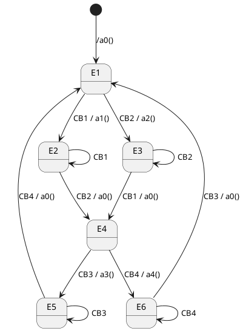

---
tags:
  - front
  - exos
---

## Exo 1 : 4 boutons alternantifs avec désactivation

![[Pasted image 20250901152807.png]]
### Resolution 1
#### Automate

![[WhatsApp Image 2025-09-01 at 15.24.04 1.jpeg]]

#### Tableau
![[Pasted image 20250903095120.png]]
Init =/a0> E1
## Exo 2 : 4 Boutons cycliques avec desctivation
![[Pasted image 20250901153059.png]]

### Resolution : 
#### Automate
![[Pasted image 20250903103257.png]]
#### Tableau
![[WhatsApp Image 2025-09-01 at 15.32.18.jpeg]]
## Exo 3 du compteur : Raté :3

#### Cache :
![[Pasted image 20250903111353.png]]
![[Pasted image 20250903111411.png]]
![[Pasted image 20250903111420.png]]

## Exo 4 : 

