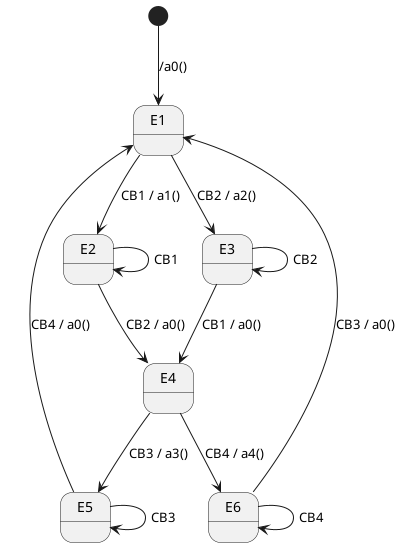
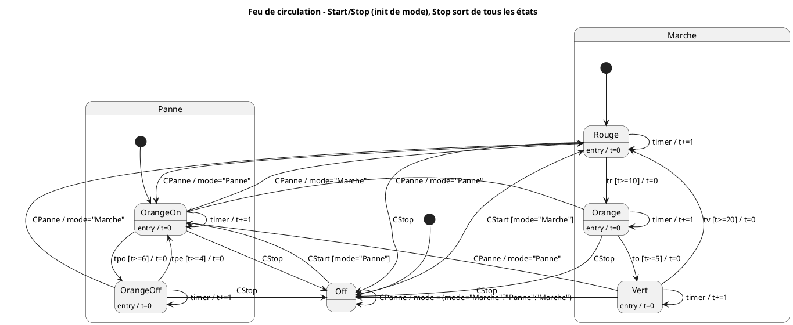

---
tags:
  - front
  - exos
---
## Exo 1  : 4 Boutons cycliques avec désactivation
![[Pasted image 20250901153059.png]]

### Resolution : 
#### Automate
![[Pasted image 20250903103257.png]]
#### Tableau
![[WhatsApp Image 2025-09-01 at 15.32.18.jpeg]]
## Exo 2 : 4 boutons alternatifs avec désactivation

![[Pasted image 20250901152807.png]]
### Resolution 1
#### Automate

![[WhatsApp Image 2025-09-01 at 15.24.04 1.jpeg]]

#### Tableau
![[Pasted image 20250903095120.png]]
Init =/a0> E1
## Exo 3 du compteur : Raté :3
Timer avec bouton start bouton pause (je l'ai raté celui là XD)
#### Cache :
![[Pasted image 20250903111353.png]]
![[Pasted image 20250903111411.png]]
![[Pasted image 20250903111420.png]]


## Exo 4 : Compteur dans les deux sens 
### énoncé
![[42bf4209-6913-4040-8981-e00a617023af.png]]

### Automate 
 
 ```plantuml
@startuml
title Compteur – FSM avec bornes (0s - 20s)

[*] --> E1

state E1 as "Idle" : Etat initial (arrété) E1
state E2 as "RunningForward" : E2
state E3 as "RunningBackward" : E3

' --- Start/Stop
E1 --> E2 : CStart
E2 --> E1 : CStop
E3 --> E1 : CStop

' --- Choix/Changement de direction
E2 --> E3 : CBWD
E3 --> E2 : CFWD

' --- Tick du timer
E2 --> E2 : timer / cpt += 1
E3 --> E3 : timer / cpt -= 1

' --- Limites
E2 --> E1 : timer / cpt  == 19
E3 --> E1 : timer / cpt =< 1 (gestion bug)

' --- Clics redondants


E1 --> E1 : timer / a0()
@enduml
 ```
## Exo 5 : Feux tricolores
### Enoncé
![[Pasted image 20250903120259.png]]
Evts : 
- CStart
- CStop
- CPanne
- tr
- to
- tv
- tpo
- tpe
`tr, to, tv` = timers rouge/orange/vert. `tpo, tpe` = timers panne ON/OFF. `CStart/CStop` = marche/arrêt. `CPanne` = bascule marche↔panne.
### Automate



